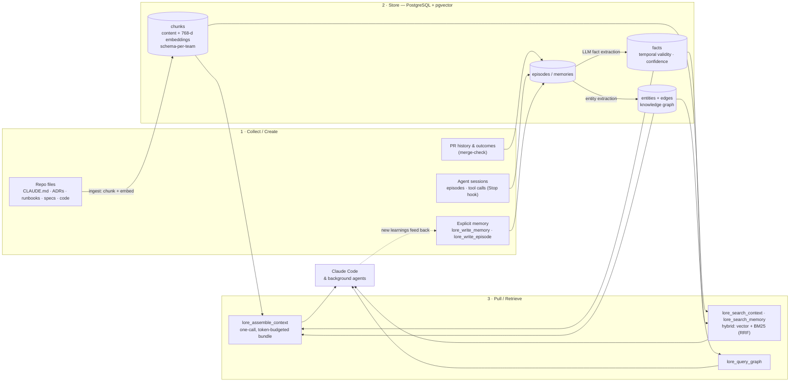

<p align="center">
  
</p>

<h1 align="center">Lore</h1>

<p align="center">
  Shared context infrastructure for Claude Code.<br/>
  Org awareness + agent memory + task pipeline in one platform.
</p>

<p align="center">
  
  
  
  
</p>

---

## What is Lore?

Lore is the shared context layer that makes Claude Code organization-aware. Developers open Claude Code and it already knows: org-wide conventions, team-specific patterns, architectural decisions, and current task state — without any manual context loading.

Beyond context, Lore is an **agent operating system**. It runs background agents that onboard repos, detect documentation gaps, check for spec drift, and review PRs — all producing pull requests that humans review and merge.

## Repository layout

```
apps/        services      floor · event-router · cluster-agent · lore-api · stations · mcp-server · web-ui
             images/tools  lore-station (station pod image) · lore-code-trace (Go binary) · vscode-extension
libs/        shared libraries           shared (@re-cinq/lore-shared) · assembly-lines (@re-cinq/lore-assembly-lines) · server-core (@re-cinq/lore-server-core)
infra/       deploy & runtime           terraform (the `lore-platform` umbrella chart) · compose.yaml · chart-ci-values
specs/       speckit specs (spec/plan/tasks/contracts) — first-class, links into code
adrs/        architecture decision records (MADR)
runbooks/    incident & operational runbooks        teams/  per-team CLAUDE.md
scripts/     install.sh · lore-doctor · task-types.yaml · infra & glue scripts
docs/        guides & longer-form docs
```

npm workspaces are `libs/*` plus each Node app listed explicitly in the root `package.json`. Two apps sit outside them: `web-ui` (standalone Next.js, its own lockfile) and `lore-code-trace` (Go, no `package.json`).

Every app and library documents itself in its own README — the shared code starts at [`libs/shared`](libs/shared/README.md), [`libs/assembly-lines`](libs/assembly-lines/README.md), and [`libs/server-core`](libs/server-core/README.md); the deployables are linked from the table below.

### Deployables

Nine workloads ship as one umbrella Helm chart, `lore-platform`, which spans a namespace per subchart. Each owns one thing, and the boundaries are enforced by credentials rather than convention.

| Deployable | Namespace | What it owns |
|---|---|---|
| **Floor** ([`apps/floor`](apps/floor/README.md)) | `lore-floor` | The three exclusive powers of [ADR-024](adrs/ADR-024-ubiquitous-language-execution-model.md): the `pipeline.events` drain loop and its reapers, the AssemblyRun walk plus Station dispatch, and the in-process SSE bus. Pinned to one replica, because only a single instance may coordinate. Holds **no** Kubernetes client. |
| **event-router** ([`apps/event-router`](apps/event-router/README.md)) | `lore-event-router` | The only writer of `pipeline.events` ([ADR-044](adrs/ADR-044-event-router-owns-the-event-bus.md)). One front door — `POST /api/events` — for every producer, authenticating GitHub by HMAC and everyone else by bearer token, plus the claim/ack/reap endpoints the Floor drains through. |
| **cluster-agent** ([`apps/cluster-agent`](apps/cluster-agent/README.md)) | `lore-cluster-agent` | The only process that talks to this cluster's Kubernetes API. Holds no database; every route under `/api/cluster/*` is a domain operation rather than a Kubernetes verb, so no `resourceVersion` ever crosses the wire. It also PUSHES: a WATCH is the one cluster capability that cannot be a request, so this owns the Agent-CR watch and reports terminal phases to the event-router over HTTP — which is what lets there be more than one execution cluster. |
| **lore-api** ([`apps/lore-api`](apps/lore-api/README.md)) | `lore-api` | The remote REST backend (`/api/*`) — hybrid search, agent memory, task CRUD, ingest ([ADR-032](adrs/ADR-032-split-local-remote-api.md)). No MCP. |
| **stations** ([`apps/stations`](apps/stations/README.md)) | `lore-stations` | Service stations, reached by name over `POST /api/stations/{name}`. Self-contained units of work that moved to where the data already is rather than being tunnelled through the Floor. |
| **lore-mcp gateway** ([`apps/mcp-server`](apps/mcp-server/README.md)) | `lore-api` | The same MCP adapter served over HTTP, so agent pods get live scoped Lore access for a whole run instead of a one-shot hydration. Also serves the agent-skills registry. |
| **web-ui** ([`apps/web-ui`](apps/web-ui/README.md)) | `lore-ui` | The Next.js dashboard. Holds no database pool — it reads through lore-api. Its chart also runs the ordered SQL migrations hook on every deploy. |
| **lore-db** ([`charts/lore-db-helm`](infra/terraform/modules/gke-mcp/lore-platform/charts/lore-db-helm/README.md)) | `lore-db` | PostgreSQL + pgvector via CloudNativePG. Schema-per-team isolation. |
| **ai-agent-subsystem** ([`charts/ai-agents-helm`](infra/terraform/modules/gke-mcp/lore-platform/charts/ai-agents-helm/README.md)) | `ai-agents` | The external controller that turns an `Agent` custom resource into an ephemeral Job pod. |

Dgraph — the spec-traceability graph — is deployed alongside the umbrella from terraform rather than as a subchart. `apps/mcp-server` also runs on each developer's laptop over stdio; the `lore-station` pod image (built from [`apps/stations`](apps/stations/README.md)) and [`apps/lore-code-trace`](apps/lore-code-trace/README.md) are an image and a binary, not services.


### The context lifecycle

Context is **collected** from repos and agent activity, **stored** in PostgreSQL (vectors + knowledge graph), and **pulled** on demand into Claude Code. Every session can feed new learnings back in, so the store compounds over time.



## Terminology

Lore is modeled as an autonomous software **factory** ("Dark Factory" is a *mode* of it). One vocabulary is used everywhere — code, specs, ADRs (see [ADR-024](adrs/ADR-024-ubiquitous-language-execution-model.md)):

| Term | What it is | Cardinality |
|---|---|---|
| **Factory** | the whole platform — Lore itself | 1 |
| **Floor** | the long-running coordinator runtime: drains the event bus, walks AssemblyRuns, dispatches Stations, reaps leases | 1 → N (per team / cluster / trust tier) |
| **AssemblyLine** | the authored blueprint — a graph of Stations with distinct responsibilities that hand off / wait on each other | per task type |
| **AssemblyRun** | one execution of an AssemblyLine, which **clones** the blueprint at start and reads the clone thereafter, so an edit cannot change the graph under a walk in flight | per attempt |
| **Station** | the unit that runs exactly one piece of work — an Agent pod, a deterministic `lore-station` pod, a **human station** whose worker is a person (it names the page they act on), or a **service station** reached by name over HTTP | per node |
| **StationRun** | one visit to a Station within an AssemblyRun — a revisit under `iteration_max` is a new StationRun | per visit |
| **Agent** | a single ephemeral run of the Claude CLI/API + a prompt (context + task) | per Station |

Hierarchy: **Factory ⊃ Floor(s) ⊃ AssemblyRuns ⊃ StationRuns ⊃ Agents** — blueprint-side, **AssemblyLine ⊃ Stations**.

> **"Agent" means only the Claude-CLI-plus-prompt run** — not the pod that hosts it (a **Station**) nor the coordinator that dispatches work (the **Floor**). The coordinator deployment was historically called "Lore Agent"; it is now the **Floor** (`apps/floor`, the `lore-floor` deployment).

## How Lore connects to Claude Code (in plain terms)

When you install Lore, Claude Code starts talking to a **small Lore program
running on your laptop**. That program is the only piece that speaks Claude
Code's language (a protocol called MCP). It doesn't hold any of the org's
knowledge itself — instead it **forwards requests to the Lore cloud service**
over the internet, where the shared database lives.

Why the split?

- The shared knowledge — conventions, memories, history — lives in **one place
  in the cloud**, so every developer sees the same thing.
- But some things can only happen on your laptop: knowing **which repository
  you're in**, running **your project's tests**, or doing work on **your own
  Claude subscription**. Those stay local.

So the laptop program is a **translator and a doorway**: Claude Code → local
Lore program → Lore cloud. The cloud service itself is a plain authenticated
web API — it is deliberately *not* a second MCP server (see
[ADR-032](adrs/ADR-032-split-local-remote-api.md) for why).

To keep this fast and resilient, the local program keeps a **short-lived cache**
of recent lookups: repeat questions are answered instantly, and if the cloud is
briefly unreachable you still get recent answers (clearly marked as cached).
Saving or changing anything always goes straight to the cloud.

For the full list of what Claude can do with Lore, in plain language, see the
[Lore Tools guide](docs/mcp-tools.md).

## Documentation

Pick the guide that matches what you're doing.

### Using Lore

- [Lore Tools — Plain-Language Guide](docs/mcp-tools.md) — what each Lore tool does, and whether it runs in the cloud or on your machine
- [Developer Guide](docs/using-lore/developer.md) — org context in Claude Code, the MCP tool catalog, the local task runner, and GitHub/Slack dispatch
- [Product Manager Guide](docs/using-lore/product-manager.md) — turn a plain-language idea into a spec and a merged PR
- [Platform Engineer Guide](docs/using-lore/platform-engineer.md) — onboard repos, tune settings, monitor the pipeline, analytics, and API security
- [Installation & Deployment](docs/INSTALL.md) — deploy the Lore backend on GKE

### Building Lore

- [Architecture](docs/building-lore/architecture.md) — topology, task lifecycle, scheduling, ingestion, memory, execution modes, and Dark Factory mode
- [Scheduled Jobs](docs/building-lore/scheduled-jobs.md) — the recurring job registry
- [Contributing](docs/building-lore/contributing.md) — run the stack locally, project layout, tech stack, and design principles

## Quickstart

```bash
git clone git@github.com:re-cinq/lore.git
cd lore && scripts/install.sh
```

This configures the MCP server, skills, hooks, statusline, and agent ID. The MCP server runs locally over stdio but proxies all operations to the GKE backend — so the backend must be deployed first. See [docs/INSTALL.md](docs/INSTALL.md) for the complete deployment guide.

Then open Claude Code and type **`/lore-help`** — what Lore does, how a session works, every skill, and which one fits the job you're on.

### Developing Lore itself

To run the whole stack on your own machine instead of against a deployed backend:

```bash
npm install
npm run dev-setup   # one-time: toolchain check + credentials into .env.local
npm start           # Postgres + Dgraph + minikube agents + every service, live reload
```

This needs Node.js >= 20 plus `docker`, `docker compose` v2, `minikube`, `kubectl`, `helm`, and `claude` on your PATH. [Contributing](docs/building-lore/contributing.md#run-the-full-stack-locally) walks through all three steps, the ports, and how to tear it all down and start over.

## License

Apache License 2.0 — see [LICENSE](LICENSE).
