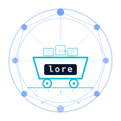
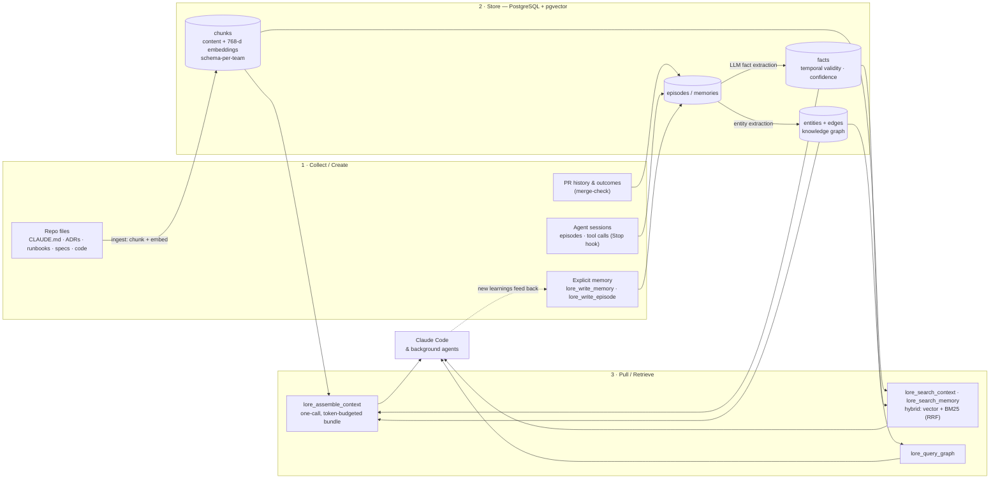

<p align="center">
  
</p>

<h1 align="center">Lore</h1>

<p align="center">
  Shared context infrastructure for Claude Code.<br/>
  Org awareness + agent memory + task pipeline in one platform.
</p>

<p align="center">
  
  
  
  
</p>

---

## What is Lore?

Lore is the shared context layer that makes Claude Code organization-aware. Developers open Claude Code and it already knows: org-wide conventions, team-specific patterns, architectural decisions, and current task state — without any manual context loading.

Beyond context, Lore is an **agent operating system**. It runs background agents that onboard repos, detect documentation gaps, check for spec drift, and review PRs — all producing pull requests that humans review and merge.

## Repository layout

```
apps/        deployable services        agent · mcp-server · web-ui · vscode-extension
libs/        shared libraries           shared (@re-cinq/lore-shared) · runner (@re-cinq/lore-runner)
infra/       deploy & runtime           terraform · docker · k8s · compose.yaml
specs/       speckit specs (spec/plan/tasks/contracts) — first-class, links into code
adrs/        architecture decision records (MADR)
runbooks/    incident & operational runbooks        teams/  per-team CLAUDE.md
scripts/     install.sh · lore-doctor · task-types.yaml · infra & glue scripts
docs/        guides & longer-form docs
```

npm workspaces live under `apps/*` + `libs/*`; `web-ui` is a standalone Next.js app (its own lockfile, not a workspace).


### The context lifecycle

Context is **collected** from repos and agent activity, **stored** in PostgreSQL (vectors + knowledge graph), and **pulled** on demand into Claude Code. Every session can feed new learnings back in, so the store compounds over time.



## Terminology

Lore is modeled as an autonomous software **factory** ("Dark Factory" is a *mode* of it). One vocabulary is used everywhere — code, specs, ADRs (see [ADR-024](adrs/ADR-024-ubiquitous-language-execution-model.md)):

| Term | What it is | Cardinality |
|---|---|---|
| **Factory** | the whole platform — Lore itself | 1 |
| **Floor** | the long-running coordinator runtime: dispatches Agents onto Stations, runs the AssemblyLines, reaps leases | 1 → N (per team / cluster / trust tier) |
| **AssemblyLine** | a workflow of Stations with distinct responsibilities that hand off / wait on each other | per task |
| **Station** | the unit that runs exactly one Agent — a Kubernetes Job pod, or a local sandbox/worktree | per task-run |
| **Agent** | a single ephemeral run of the Claude CLI/API + a prompt (context + task) | per Station |

Hierarchy: **Factory ⊃ Floor(s) ⊃ AssemblyLines ⊃ Stations ⊃ Agents.**

> **"Agent" means only the Claude-CLI-plus-prompt run** — not the pod that hosts it (a **Station**) nor the coordinator that dispatches work (the **Floor**). The coordinator deployment was historically called "Lore Agent"; the rename to **Floor** (`apps/agent` → `apps/floor`) is in progress.

## Documentation

Pick the guide that matches what you're doing.

### Using Lore

- [Developer Guide](docs/using-lore/developer.md) — org context in Claude Code, the MCP tool catalog, the local task runner, and GitHub/Slack dispatch
- [Product Manager Guide](docs/using-lore/product-manager.md) — turn a plain-language idea into a spec and a merged PR
- [Platform Engineer Guide](docs/using-lore/platform-engineer.md) — onboard repos, tune settings, monitor the pipeline, analytics, and API security
- [Installation & Deployment](docs/INSTALL.md) — deploy the Lore backend on GKE

### Building Lore

- [Architecture](docs/building-lore/architecture.md) — topology, task lifecycle, scheduling, ingestion, memory, execution modes, and Dark Factory mode
- [Scheduled Jobs](docs/building-lore/scheduled-jobs.md) — the recurring job registry
- [Contributing](docs/building-lore/contributing.md) — run the stack locally, project layout, tech stack, and design principles

## Quickstart

```bash
git clone git@github.com:re-cinq/lore.git
cd lore && scripts/install.sh
```

This configures the MCP server, skills, hooks, statusline, and agent ID. The MCP server runs locally over stdio but proxies all operations to the GKE backend — so the backend must be deployed first. See [docs/INSTALL.md](docs/INSTALL.md) for the complete deployment guide.

## License

Apache License 2.0 — see [LICENSE](LICENSE).
