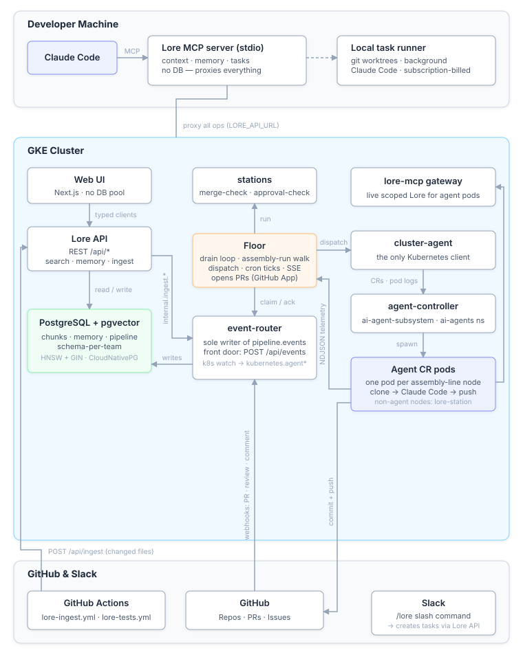
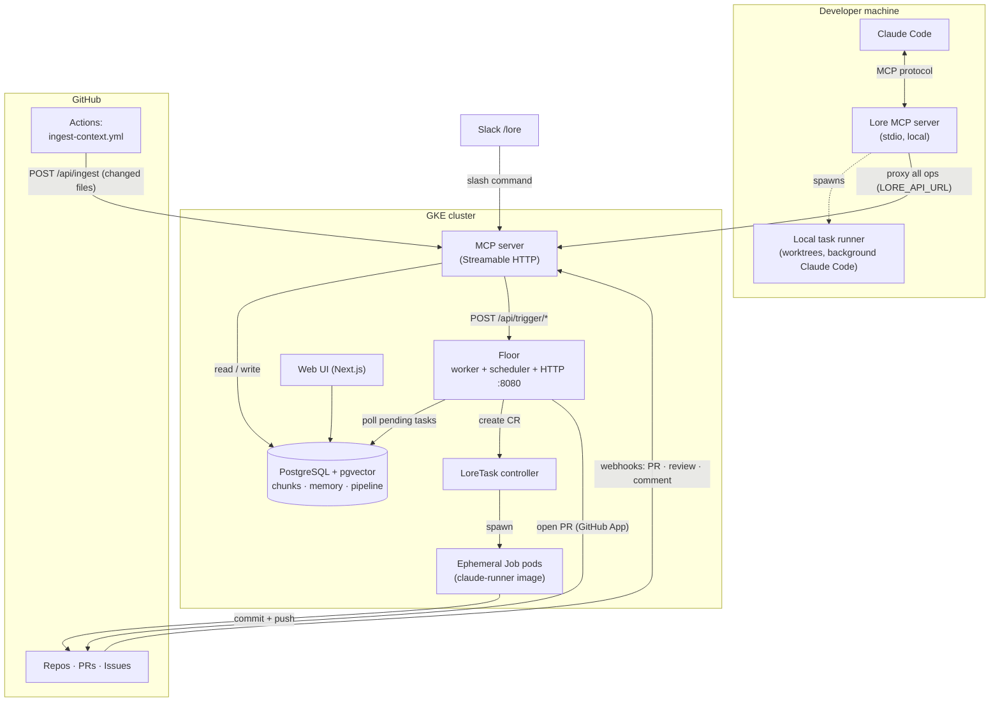
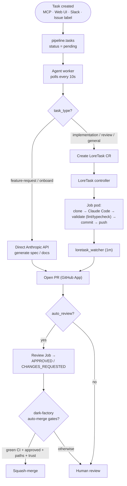
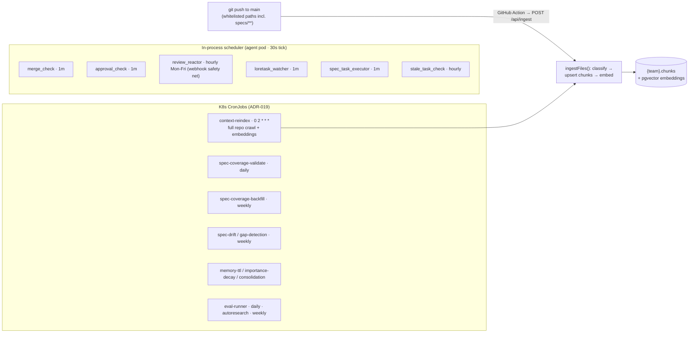

# Architecture

**For people building Lore itself.** This is the deep-dive reference for how the platform fits together: how the pieces connect, how a task flows from creation to a merged PR, how context reaches the vector store, and how the memory system, execution modes, and Dark Factory mode work. If you're using Lore rather than building it, the [user guides](../using-lore/) will serve you better.

Read it top to bottom for the full picture, or jump to the section you're touching.

---

## System topology

How the pieces connect at runtime. The local MCP server proxies every operation to the GKE backend, so all context and memory is org-wide.

## Task lifecycle

How one pipeline task goes from created to merged. Simple tasks call the Anthropic API inline; code tasks run in isolated Job pods.

## Scheduling and ingestion

There are two live scheduling layers (split per ADR-019). Hot-path jobs run inside the agent pod; heavy batch jobs run as isolated K8s CronJob pods via `node dist/job-runner.js <job>`. Context reaches the vector store two ways: the push-triggered `/api/ingest` doorbell (immediate, changed files only) and the nightly `context-reindex` crawl (full reconciliation, deletes orphans).

> A legacy GCP Cloud Scheduler nightly (`lore-nightly-full-reindex` in `terraform/.../cloud-scheduler.tf`) still calls the `delegate_task` tool that was retired with the prior agent runtime (ADR-007). It is superseded by the `context-reindex` CronJob above and is safe to remove.

The full job registry — every schedule and what it does — is in [Scheduled Jobs](scheduled-jobs.md).

## Key components

| Component | What it does |
|-----------|-------------|
| **MCP Server** | Serves org context to Claude Code via the MCP protocol. Hybrid search (vector + BM25). Agent memory. Task CRUD. Push-triggered ingest API. Per-client scoped tokens. Rate-limited. |
| **Floor** | Processes pipeline tasks. Calls the Claude API for simple tasks; delegates complex tasks (implementation) to ephemeral Job pods via the LoreTask CRD. Runs the scheduled maintenance jobs. Creates PRs via the GitHub App. Every task automatically opens a GitHub Issue on the target repo so developers see what Lore is doing without checking the dashboard; Issues are updated on status changes and closed when the PR is created. |
| **LoreTask Controller** | Watches LoreTask custom resources and spawns ephemeral K8s Job pods with the claude-runner image. Each Job pod clones the target repo, runs Claude Code, commits, and pushes. Tasks survive agent deploys and run in parallel with full isolation. Pods run as non-root with dropped capabilities and an egress-restricted NetworkPolicy. |
| **Web UI** | Next.js dashboard with GitHub OAuth. Repo-centric view. One-click onboarding. Pipeline monitoring. Analytics dashboard. Global settings. |
| **PostgreSQL** | CloudNativePG with pgvector. Schema-per-team isolation. HNSW indexes for vector search, GIN for keyword. |
| **GitHub App** | Reads repo content for onboarding. Creates branches, commits, and PRs. Sets Actions secrets for ingest automation. |

## Search

Hybrid search combines vector similarity (Vertex AI `text-embedding-005`, 768 dimensions) with BM25 keyword matching via Reciprocal Rank Fusion (k=60). It degrades gracefully to keyword-only when embeddings are unavailable.

## Agent memory

Lore exposes 15 MCP tools for persistent memory across sessions and restarts. Every memory is versioned, timestamped, and semantically searchable. When running locally, all memory operations are proxied to the GKE MCP server so learnings are shared org-wide.

Key capabilities:

- **Temporal fact invalidation** — facts have validity windows; contradictory facts are automatically invalidated via embedding similarity (threshold 0.92).
- **Confidence tiers** — facts carry `verified`/`observed`/`inferred`/`stale` confidence. Episode-sourced facts default to `observed`, memory-sourced to `inferred`. Unretrieved facts transition to `stale` after 30 days. Context assembly and search include confidence annotations.
- **Retrieval strengthening** — every search asynchronously increments the retrieval count, extends half-life (+2, cap 365), and revives stale→observed. Frequently-used facts survive decay longer.
- **Conflict surfacing** — contradictions are recorded in the `fact_conflicts` table. Context assembly prefixes `[CONFLICT]` on disputed facts (7-day window).
- **Transfer scoring** — cross-repo context is filtered by portable/local keyword heuristics. Only facts with a transfer score ≥ 0.5 pass through, preventing repo-specific config from polluting other repos.
- **Outcome feedback** — merged PRs boost contributing facts' half-life (+5); rejected PRs penalize (-3). Contributing refs are tracked via the `context_refs` JSONB column on tasks.
- **Passive episode ingestion** — `lore_write_episode` accepts raw text (conversations, reviews, observations); facts and knowledge graph entities are extracted automatically. PR review feedback is auto-captured by the review-reactor job. Session summaries are captured via a Stop hook.
- **Live knowledge graph** — entities (services, teams, technologies) and relationships are tracked in PostgreSQL, updated incrementally on every episode. Query with `lore_query_graph`.
- **Graph-augmented search** — `lore_search_memory(graph_augment=true)` enriches results with 1-hop knowledge graph neighbors of detected entities.
- **Context assembly** — `lore_assemble_context` retrieves from all sources and formats into a token-budgeted block using configurable YAML templates (default, review, implementation, research). Supports **subdirectory convention rules** — `.claude/rules/*.md` files loaded conditionally based on task keywords.
- **Pre-run hydration** — both the local runner and the GKE entrypoint fetch assembled context before spawning Claude Code, so agents start with rich context on turn 1.
- **Passive session capture** — the MCP server tracks all tool calls; on session exit it dumps and POSTs a summary as an episode with automatic fact extraction. No explicit `lore_write_episode` needed.
- **Post-task auto-curation** — every task completion (PR, no-changes, failure) automatically captures an episode. High-signal events get Haiku-driven lesson extraction stored as searchable memories.
- **Importance-based decay** — half-life decay model: `strength = 0.5^(age / half_life_days)`. Retrieval count and confidence factor into scoring. Low-value entries are auto-evicted above 500 memories; old invalidated facts are cleaned up beyond a 2000 cap.
- **Automatic consolidation** — groups recent facts by repo and synthesizes higher-level patterns via Haiku, turning noisy raw facts into actionable insights.
- **Privacy filtering** — secrets, API keys, JWTs, and connection strings are stripped before anything is stored in org-wide memory.
- **Retrieval benchmarks** — p50/p95/p99 latency is tracked per tool in the audit log and shown in the analytics dashboard.

## Agent execution modes

The agent service chooses an execution mode based on the task type configured in `task-types.yaml`.

| Mode | When | How |
|------|------|-----|
| **API call** | Onboarding, runbooks, gap-fill, review, review-reactor fixes | Direct `@anthropic-ai/sdk` call to Claude Haiku. Fast, lightweight. Plain text in, plain text out. |
| **Claude Code (ephemeral Job)** | Implementation, refactoring, complex analysis | Creates a LoreTask CR → controller spawns an ephemeral K8s Job pod with the claude-runner image. Full tool access, isolated resources, survives agent deploys. |
| **Multi-agent** | Large implementation tasks | Multiple LoreTask Jobs run in parallel, each on a different part of the task (e.g. one agent per file or module). Results merge into a single PR. |
| **Feature request** | PM intent | Fetches repo context, generates spec/data-model/tasks as individual files. Each artifact gets its own focused LLM call. |
| **Local runner** | Developer says "run locally" | Background `claude --print` in an isolated git worktree on the developer's machine. Uses the Claude Code subscription — zero API cost. Non-blocking; PR created via `gh`. |

Every mode includes **deterministic validation** — after the agent edits code, lint and typecheck run as mandatory pipeline stages (detected from `package.json`, `go.mod`, `pyproject.toml`, or `Cargo.toml`). If validation fails, one automatic fix retry runs before escalating to human review. K8s Jobs retry once on transient failures (`backoffLimit: 1`). Failed tasks can be retried via `/lore retry <task_id>`, the `lore_retry_task` MCP tool, or the API.

All agent API calls also go through **multi-block prompt caching** (ADR-015 + `agent/src/lib/prompt-cache.ts`): the system prompt and tool schemas each carry a `cache_control: {type: "ephemeral"}` breakpoint, so a tool edit doesn't bust the system cache and vice versa. Jobs whose prompts are stable and cluster within an hour (auto-curation, review-reactor fixes, fact extraction, graph extraction — override via `LORE_CACHE_1H_JOBS`) use the 1-hour cache TTL; eligibility is latched at process start to prevent mid-session TTL flips. Each call's log line annotates the cache outcome (`hit` / `first-call` / `break:system` / `break:tools` / `break:ttl(42m)`) for live cost diagnostics.

## Dark Factory mode

Lore can run as a **dark software factory**: autonomous operation as the default, with humans only at intent definition and stage-gate validation. When enabled for a repo:

- **The branch is the durable state.** Every workflow phase commits with `Lore-Stage:` / `Lore-Iteration:` / `Lore-Task:` trailers. A supervisor pod that dies resumes from `git log` on the branch — no DB checkpoints, no parallel ledger.
- **Workflows are declarative YAML graphs.** `agent/src/workflows/<task-type>.yaml` with 4 node types (`agent | validate | gate | retrospective`) and 4 edge conditions. The local runner and the GKE supervisor share definitions.
- **Auto-merge for low-blast-radius outputs.** Path-allowlisted PRs (`specs/`, `adrs/`, `*.md`, `CLAUDE.md`, `.claude/`) on green CI + bot `APPROVED` + repo trust ≥ `min_trust` are squash-merged. Seven distinct deferral outcomes are recorded in `pipeline.audit_log` with the full rule trace.
- **Issues become an exception surface.** Created only for approval gates, escalations (`needs-human-help`), or repos that explicitly opted into `create_issue: always`. Cross-reference is via the `Lore-Task: <uuid>` trailer in the PR body.
- **Two-key auth on privileged settings.** Toggling `enabled` or modifying `auto_merge.paths` requires admin scope **and** an open PR labeled `dark-factory-approval` by a CODEOWNER of the affected repo's `CLAUDE.md`.

Enablement is gated twice — per-repo and cluster-wide — so the Helm flag can't get ahead of the claude-runner image. Operators turning it on should read the enablement steps in the [Platform Engineer Guide](../using-lore/platform-engineer.md#dark-factory-mode). The full design is in ADR-016 and `specs/6-dark-factory/`; rollout and rollback live in `runbooks/dark-factory-rollback.md`.

---

## See also

- [Scheduled Jobs](scheduled-jobs.md) — the complete cron/job registry referenced by the scheduling diagram.
- [Contributing](contributing.md) — run the stack locally, project layout, tech stack, design principles.
- [Platform Engineer Guide](../using-lore/platform-engineer.md) — operating these components in production.
- [Back to README](../../README.md)
