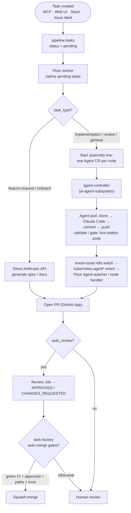
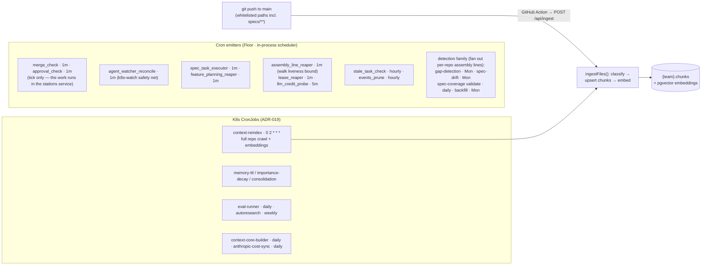

# Architecture

**For people building Lore itself.** This is the deep-dive reference for how the platform fits together: how the pieces connect, how a task flows from creation to a merged PR, how context reaches the vector store, and how the memory system, execution modes, and Dark Factory mode work. If you're using Lore rather than building it, the [user guides](../using-lore/) will serve you better.

Read it top to bottom for the full picture, or jump to the section you're touching.

---

## System topology

How the pieces connect at runtime. The local MCP server proxies every operation to the GKE backend, so all context and memory is org-wide.

Two boundaries are load-bearing and enforced by credentials rather than convention. **`event-router` is the only writer of `pipeline.events`** ([ADR-044](../../adrs/ADR-044-event-router-owns-the-event-bus.md)): every producer reports to its one front door, and the Floor claims work back over HTTP. **`cluster-agent` is the only process that talks to this cluster's Kubernetes API** — the Floor holds no Kubernetes client at all, and reaches dispatch, pod logs, and per-task tokens through it.

> **Webhook cutover, in progress.** The event-router's public ingress serves `/api/events` and is standing, but `LORE_WEBHOOK_URL` still points onboarded repos at the Floor's `/api/webhook/github`. Either door is correct today — the Floor's route no longer writes to the database, it reports through the router like every other producer — and the repos get re-pointed before that route is deleted. Reversing that order would drop deliveries.

## Task lifecycle

How one pipeline task goes from created to merged. Simple tasks call the Anthropic API inline; code tasks run in isolated Job pods. Note that no step here observes the cluster directly: a pod's completion reaches the Floor as a `kubernetes.agent*` event that the event-router's watch reported, and the Floor's minute-by-minute reconcile pass re-emits anything that watch dropped.

## Scheduling and ingestion

There are two live scheduling layers (split per ADR-019). Hot-path ticks are emitted in-process inside the Floor; heavy batch jobs run as isolated K8s CronJob pods via `node dist/delivery/job-runner.js <job>`. An emitter only writes a `cron.<name>.tick` event — the drain loop dispatches the handler — and a handler is not obliged to do the work itself: `merge_check` and `approval_check` call the **stations** service over HTTP, because scheduling *when* something runs and owning *what* it does are separate concerns ([ADR-044](../../adrs/ADR-044-event-router-owns-the-event-bus.md) amendment). Context reaches the vector store two ways: the push-triggered `/api/ingest` doorbell (immediate, changed files only) and the nightly `context-reindex` crawl (full reconciliation, deletes orphans).

The full job registry — every schedule and what it does — is in [Scheduled Jobs](scheduled-jobs.md).

## Key components

| Component | What it does |
|-----------|-------------|
| **Lore API** | The remote REST backend (`/api/*`) on GKE (ADR-032). Hybrid search (vector + BM25), agent memory, task CRUD, the push-triggered ingest API, per-client scoped tokens, rate-limited. |
| **MCP Server** | A thin local stdio adapter that speaks the MCP protocol to Claude Code and proxies every operation to the Lore API via `LORE_API_URL`. Also hosts the local task runner. The same binary runs in-cluster as the **lore-mcp gateway** (`LORE_MCP_HTTP=1`), giving agent pods live scoped Lore access for a whole run rather than a one-shot hydration, and serving the agent-skills registry. |
| **Floor** | The coordinator, pinned to one replica and holding exactly three powers ([ADR-024](../../adrs/ADR-024-ubiquitous-language-execution-model.md)): the `pipeline.events` drain loop and its reapers, the AssemblyRun walk plus Station dispatch, and the in-process SSE bus behind the live run view. Dispatches complex tasks as `Agent` CRs — one pod per assembly-line node — through the cluster agent, since it holds no Kubernetes client of its own. Emits the cron ticks, creates PRs via the GitHub App, and keeps auto-merge authority (deliberately not delegated to a pod). Every task automatically opens a GitHub Issue on the target repo so developers see what Lore is doing without checking the dashboard; Issues are updated on status changes and closed when the PR is created — unless Dark Factory mode narrows that (see below). |
| **event-router** | The single owner of `pipeline.events` (ADR-044). One front door, `POST /api/events`, takes every producer: GitHub webhooks authenticated by HMAC over the raw body, and the Kubernetes watch, cron ticks, CI ingest, human-station resumes, and internal ingest triggers by bearer token. It also serves the six claim/ack/fail/dead-letter/reap/prune endpoints the Floor drains through — no endpoint on that side can write an event, because producing and draining are different privileges. Holds the streaming Agent-CR watch that turns a terminal CR into a `kubernetes.agent*` event. |
| **cluster-agent** | The only process that talks to this cluster's Kubernetes API. Holds no database — every caller brings its own state and asks this for cluster operations only. Each `/api/cluster/*` route is a **domain operation, not a Kubernetes verb**: three of the underlying interactions are read-modify-write pairs, so exposing `get` and `replace` separately would invite a caller to split a pair across the network and lose the update. No `resourceVersion` ever crosses the wire, and lists are one apiserver page per call with the caller driving `continue`. |
| **stations (service)** | Service stations reached by name over `POST /api/stations/{name}` — currently `merge-check` and `approval-check`. Self-contained units of work that moved to where the data already is instead of being tunnelled through the Floor. It schedules nothing itself: the Floor still owns *when* a station runs; this owns *what* it does. |
| **ai-agent-subsystem** | The external agent-controller (`ai-agents` namespace) watches `Agent` custom resources (→ `Station` PodTemplate → `AgentDefinition` recipe) and stamps an ephemeral Job pod per run. Agent pods clone the target repo, run Claude Code, commit, and push; deterministic nodes (validate/gate/retrospective/detect) run the `lore-station` image via the `exec` vendor. Tasks survive Floor deploys and run in parallel with full isolation. Pods run as non-root with dropped capabilities and an egress-restricted NetworkPolicy. |
| **Web UI** | Next.js dashboard with GitHub OAuth. Repo-centric view. One-click onboarding. Pipeline monitoring. Analytics dashboard. Global settings. Holds **no** database pool — every read goes through lore-api via typed clients generated from its OpenAPI schema. |
| **PostgreSQL** | CloudNativePG with pgvector. Schema-per-team isolation. HNSW indexes for vector search, GIN for keyword. |
| **GitHub App** | Reads repo content for onboarding. Creates branches, commits, and PRs. Sets Actions secrets for ingest automation. |

## Search

Hybrid search combines vector similarity (Vertex AI `text-embedding-005`, 768 dimensions) with BM25 keyword matching via Reciprocal Rank Fusion (k=60). It degrades gracefully to keyword-only when embeddings are unavailable.

## Agent memory

Lore exposes 40+ MCP tools, memory among them, for persistent state across sessions and restarts. Every memory is versioned, timestamped, and semantically searchable. The MCP adapter holds no database pool ([ADR-032](../../adrs/ADR-032-split-local-remote-api.md)), so every memory operation is proxied to lore-api and learnings are shared org-wide; `~/.lore/memory/` is the fallback when no API is configured.

Key capabilities:

- **Temporal fact invalidation** — facts have validity windows; contradictory facts are automatically invalidated via embedding similarity (threshold 0.92).
- **Confidence tiers** — facts carry `verified`/`observed`/`inferred`/`stale` confidence. Episode-sourced facts default to `observed`, memory-sourced to `inferred`. Unretrieved facts transition to `stale` after 30 days. Context assembly and search include confidence annotations.
- **Retrieval strengthening** — every search asynchronously increments the retrieval count, extends half-life (+2, cap 365), and revives stale→observed. Frequently-used facts survive decay longer.
- **Conflict surfacing** — contradictions are recorded in the `fact_conflicts` table. Context assembly prefixes `[CONFLICT]` on disputed facts (7-day window).
- **Transfer scoring** — cross-repo context is filtered by portable/local keyword heuristics. Only facts with a transfer score ≥ 0.5 pass through, preventing repo-specific config from polluting other repos.
- **Outcome feedback** — merged PRs boost contributing facts' half-life (+5); rejected PRs penalize (-3). Contributing refs are tracked via the `context_refs` JSONB column on tasks.
- **Passive episode ingestion** — `lore_write_episode` accepts raw text (conversations, reviews, observations); facts and knowledge graph entities are extracted automatically. PR review feedback is auto-captured by the review-reactor job. Session summaries are captured via a Stop hook.
- **Live knowledge graph** — entities (services, teams, technologies) and relationships are tracked in PostgreSQL, updated incrementally on every episode. Query with `lore_query_graph`.
- **Graph-augmented search** — `lore_search_memory(graph_augment=true)` enriches results with 1-hop knowledge graph neighbors of detected entities.
- **Context assembly** — `lore_assemble_context` retrieves from all sources and formats into a token-budgeted block using configurable YAML templates (default, review, implementation, research). Supports **subdirectory convention rules** — `.claude/rules/*.md` files loaded conditionally based on task keywords.
- **Pre-run hydration** — both the local runner and the GKE entrypoint fetch assembled context before spawning Claude Code, so agents start with rich context on turn 1.
- **Passive session capture** — the MCP server tracks all tool calls; on session exit it dumps and POSTs a summary as an episode with automatic fact extraction. No explicit `lore_write_episode` needed.
- **Post-task auto-curation** — every task completion (PR, no-changes, failure) automatically captures an episode. High-signal events get Haiku-driven lesson extraction stored as searchable memories.
- **Importance-based decay** — half-life decay model: `strength = 0.5^(age / half_life_days)`. Retrieval count and confidence factor into scoring. Low-value entries are auto-evicted above 500 memories; old invalidated facts are cleaned up beyond a 2000 cap.
- **Automatic consolidation** — groups recent facts by repo and synthesizes higher-level patterns via Haiku, turning noisy raw facts into actionable insights.
- **Privacy filtering** — secrets, API keys, JWTs, and connection strings are stripped before anything is stored in org-wide memory.
- **Retrieval benchmarks** — p50/p95/p99 latency is tracked per tool in the audit log and shown in the analytics dashboard.

## Agent execution modes

The Floor chooses an execution mode based on the task type configured in `task-types.yaml`.

| Mode | When | How |
|------|------|-----|
| **API call** | Onboarding, feature-request generation, review-reactor fixes | Direct `@anthropic-ai/sdk` call to Claude Haiku. Fast, lightweight. Plain text in, plain text out. |
| **Claude Code (Agent CR)** | Implementation, refactoring, runbooks, gap-fill, review, complex analysis | Creates an `Agent` CR (or, for task types with a workflow, a Floor-driven assembly line: one CR per node) → the ai-agent-subsystem controller spawns an ephemeral, isolated pod per run. Full tool access, isolated resources, survives Floor deploys. |
| **Feature request** | PM intent | Fetches repo context, generates spec/data-model/tasks as individual files. Each artifact gets its own focused LLM call. |
| **Local runner** | Developer says "run locally" | Background `claude --print` in an isolated git worktree on the developer's machine. Uses the Claude Code subscription — zero API cost. Non-blocking; PR created via `gh`. |

Every mode includes **deterministic validation** — after the agent edits code, lint and typecheck run as mandatory pipeline stages (detected from `package.json`, `go.mod`, `pyproject.toml`, or `Cargo.toml`). If validation fails, one automatic fix retry runs before escalating to human review. K8s Jobs retry once on transient failures (`backoffLimit: 1`). Failed tasks can be retried via `/lore retry <task_id>`, the `lore_retry_task` MCP tool, or the API.

All agent API calls also go through **multi-block prompt caching** (ADR-015 + `libs/shared/src/llm/prompt-cache.ts`): the system prompt and tool schemas each carry a `cache_control: {type: "ephemeral"}` breakpoint, so a tool edit doesn't bust the system cache and vice versa. Jobs whose prompts are stable and cluster within an hour (auto-curation, review-reactor fixes, fact extraction, graph extraction — override via `LORE_CACHE_1H_JOBS`) use the 1-hour cache TTL; eligibility is latched at process start to prevent mid-session TTL flips. Each call's log line annotates the cache outcome (`hit` / `first-call` / `break:system` / `break:tools` / `break:ttl(42m)`) for live cost diagnostics.

## Dark Factory mode

Lore can run as a **dark software factory**: autonomous operation as the default, with humans only at intent definition and stage-gate validation. When enabled for a repo:

- **The branch is the durable state.** Every workflow phase commits with `Lore-Stage:` / `Lore-Iteration:` / `Lore-Task:` trailers. A supervisor pod that dies resumes from `git log` on the branch — no DB checkpoints, no parallel ledger.
- **Assembly lines are declarative YAML graphs.** `libs/assembly-lines/src/assembly-lines/<task-type>.yaml`, with 4 edge conditions (`success | changes_requested | failed | always`) and node types beyond the original four: `agent`, `validate`, `gate`, `retrospective`, `github_action`, `detect`, `comment-triage`, `ingest`, `issues`, plus **human station** types whose worker is a person and whose `route` names the page they act on. Every non-agent node dispatches a `lore-station` pod ([ADR-031](../../adrs/ADR-031-agent-station-crds.md) amendment). Definitions are executed by the Floor today; the local runner spawns Claude Code directly and does not yet load them.
- **Auto-merge for low-blast-radius outputs.** Path-allowlisted PRs (`specs/`, `adrs/`, `*.md`, `CLAUDE.md`, `.claude/`) on green CI + bot `APPROVED` + repo trust ≥ `min_trust` are squash-merged. Seven distinct deferral outcomes are recorded in `pipeline.audit_log` with the full rule trace.
- **Issues become an exception surface.** Created only for approval gates, escalations (`needs-human-help`), or repos that explicitly opted into `create_issue: always`. Cross-reference is via the `Lore-Task: <uuid>` trailer in the PR body.
- **Two-key auth on privileged settings.** Toggling `enabled` or modifying `auto_merge.paths` requires admin scope **and** an open PR labeled `dark-factory-approval` by a CODEOWNER of the affected repo's `CLAUDE.md`.

Enablement is a single per-repo gate (`dark_factory.enabled`, itself a two-key privileged change); the legacy cluster-wide gate went away with the LoreTask path in the ADR-031 cutover. Operators turning it on should read the enablement steps in the [Platform Engineer Guide](../using-lore/platform-engineer.md#dark-factory-mode). The full design is in ADR-016 and `specs/6-dark-factory/`; rollout and rollback live in `runbooks/dark-factory-rollback.md`.

---

## See also

- [Scheduled Jobs](scheduled-jobs.md) — the complete cron/job registry referenced by the scheduling diagram.
- [Contributing](contributing.md) — run the stack locally, project layout, tech stack, design principles.
- [Platform Engineer Guide](../using-lore/platform-engineer.md) — operating these components in production.
- [Back to README](../../README.md)
