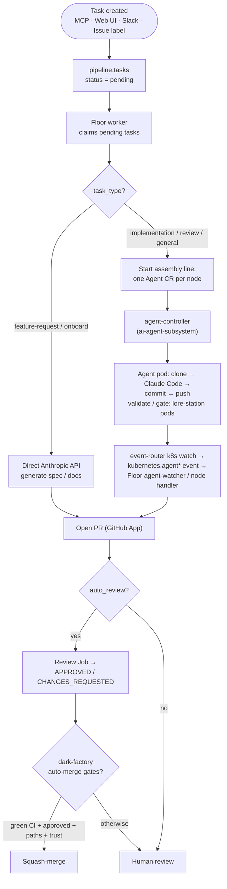
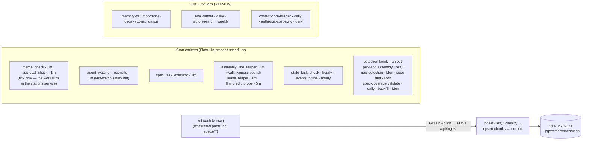

# Architecture

**For people building Lore itself.** This is the deep-dive reference for how the platform fits together: how the pieces connect, how a task flows from creation to a merged PR, how context reaches the vector store, and how the memory system, execution modes, and Dark Factory mode work. If you're using Lore rather than building it, the [user guides](../using-lore/) will serve you better.

Read it top to bottom for the full picture, or jump to the section you're touching.

---

## System topology

How the pieces connect at runtime. The local MCP server proxies every operation to the GKE backend, so all context and memory is org-wide.

Two boundaries are load-bearing and enforced by credentials rather than convention. **`event-router` is the only writer of `pipeline.events`** ([ADR-044](../../adrs/ADR-044-event-router-owns-the-event-bus.md)): every producer reports to its one front door, and each subscriber (today the stations service) claims its deliveries back over HTTP. **`cluster-agent` is the only process that talks to this cluster's Kubernetes API** — no other Lore service holds a Kubernetes client.

> **Webhook cutover, done (2026-09-08).** GitHub delivers to the event-router's `/api/events`; that is the URL lore-api installs on a repo and classifies against (`LORE_WEBHOOK_URL`). The Floor's `/api/webhook/github` route is gone, but the URL is not: the Floor-host ingress rewrites that exact path onto the router, so a repo onboarded before the cutover keeps delivering until lore-api repoints its hook (ensure / the repo page). Nothing forces the migration and GitHub never sees a 404.

## Task lifecycle

> **Out of date since 2026-10-02.** This section describes Lore's own Floor (`apps/floor`), which is deleted. Every assembly line now runs on the external floor ([ADR-049](../../adrs/ADR-049-external-floor.md), `specs/external-floor`), the cron ticks are emitted and answered by the stations service, and nothing auto-merges. The text below is kept until the section is rewritten (tracked in #2428).

How one pipeline task goes from created to merged. Simple tasks call the Anthropic API inline; code tasks run in isolated Job pods. Note that no step here observes the cluster directly: a pod's completion reaches the Floor as a `kubernetes.agent*` event that the event-router's watch reported, and the Floor's minute-by-minute reconcile pass re-emits anything that watch dropped.

```mermaid
flowchart TB
    START(["Task created<br/>MCP · Web UI · Slack · Issue label"]) --> Q["pipeline.tasks<br/>status = pending"]
    Q --> W["Floor worker<br/>claims pending tasks"]
    W --> TYPE{"task_type?"}
    TYPE -->|"feature-request / onboard"| LLM["Direct Anthropic API<br/>generate spec / docs"]
    TYPE -->|"implementation / review / general"| CR["Start assembly line:<br/>one Agent CR per node"]
    CR --> CTRL["agent-controller<br/>(ai-agent-subsystem)"]
    CTRL --> POD["Agent pod: clone → Claude Code →<br/>commit → push<br/>validate / gate: lore-station pods"]
    POD --> WATCH["event-router k8s watch →<br/>kubernetes.agent* event →<br/>Floor agent-watcher / node handler"]
    LLM --> PR["Open PR (GitHub App)"]
    WATCH --> PR
    PR --> REVIEW{"auto_review?"}
    REVIEW -->|"yes"| RR["Review Job →<br/>APPROVED / CHANGES_REQUESTED"]
    REVIEW -->|"no"| HUMAN["Human review"]
    RR --> MERGE{"dark-factory<br/>auto-merge gates?"}
    MERGE -->|"green CI + approved + paths + trust"| SQUASH["Squash-merge"]
    MERGE -->|"otherwise"| HUMAN
```

## Scheduling and ingestion

> **Out of date since 2026-10-02.** This section describes Lore's own Floor (`apps/floor`), which is deleted. Every assembly line now runs on the external floor ([ADR-049](../../adrs/ADR-049-external-floor.md), `specs/external-floor`), the cron ticks are emitted and answered by the stations service, and nothing auto-merges. The text below is kept until the section is rewritten (tracked in #2428).

There are two live scheduling layers (split per ADR-019). Hot-path ticks are emitted in-process inside the Floor; heavy batch jobs run as isolated K8s CronJob pods via `node dist/transport/job-runner.js <job>`. An emitter only writes a `cron.<name>.tick` event — the drain loop dispatches the handler — and a handler is not obliged to do the work itself: `merge_check` and `approval_check` call the **stations** service over HTTP, because scheduling *when* something runs and owning *what* it does are separate concerns ([ADR-044](../../adrs/ADR-044-event-router-owns-the-event-bus.md) amendment). Context reaches the vector store one way: the push-triggered `/api/ingest` doorbell (immediate, changed files only, a rename posted as delete + add). The nightly `context-reindex` crawl was retired (#1880); orphan chunks — paths gone from the tree, or refused by today's classifier — are swept on demand by `POST /api/repos/{owner}/{repo}/chunks/prune` (`scripts/infra/prune-orphan-chunks.sh` posts `git ls-files`).

```mermaid
flowchart LR
    subgraph inproc["Cron emitters (Floor · in-process scheduler)"]
        direction TB
        J1["merge_check · 1m · approval_check · 1m<br/>(tick only — the work runs in the stations service)"]
        J4["agent_watcher_reconcile · 1m (k8s-watch safety net)"]
        J5["spec_task_executor · 1m"]
        J8["assembly_line_reaper · 1m (walk liveness bound)<br/>lease_reaper · 1m · llm_credit_probe · 5m"]
        J6["stale_task_check · hourly · events_prune · hourly"]
        J7["detection family (fan out per-repo assembly lines):<br/>gap-detection · Mon · spec-drift · Mon<br/>spec-coverage validate · daily · backfill · Mon"]
    end

    subgraph k8scron["K8s CronJobs (ADR-019)"]
        direction TB
        C5["memory-ttl / importance-decay / consolidation"]
        C6["eval-runner · daily · autoresearch · weekly"]
        C7["context-core-builder · daily · anthropic-cost-sync · daily"]
    end

    PUSH["git push to main<br/>(whitelisted paths incl. specs/**)"] -->|"GitHub Action → POST /api/ingest"| ING["ingestFiles(): classify →<br/>upsert chunks → embed"]
    ING --> DB[("{team}.chunks<br/>+ pgvector embeddings")]
```

The full job registry — every schedule and what it does — is in [Scheduled Jobs](scheduled-jobs.md).

## Key components

| Component | What it does |
|-----------|-------------|
| [**Lore API**](../../apps/lore-api/README.md) | The remote REST backend (`/api/*`) on GKE (ADR-032). Hybrid search (vector + BM25), agent memory, task CRUD, the push-triggered ingest API, per-client scoped tokens, rate-limited. |
| [**MCP Server**](../../apps/mcp-server/README.md) | A thin local stdio adapter that speaks the MCP protocol to Claude Code and proxies every operation to the Lore API via `LORE_API_URL`. Also hosts the local task runner. The same binary runs in-cluster as the **lore-mcp gateway** (`LORE_MCP_HTTP=1`), giving agent pods live scoped Lore access for a whole run rather than a one-shot hydration, and serving the agent-skills registry. |
| **External floor** | The assembly-line engine ([re-cinq/floor](https://github.com/re-cinq/floor), [ADR-049](../../adrs/ADR-049-external-floor.md)): it walks every line from its pipeline file (`libs/assembly-lines/src/floor-pipelines/*.yaml`) and runs agent stations as `Agent` custom resources. Lore reaches it only through `@re-cinq/floor-client`; lore-api puts the pipeline files to it at boot and mints its git credentials. Lore's own Floor (`apps/floor`) was deleted on 2026-10-02. |
| [**event-router**](../../apps/event-router/README.md) | The single owner of `pipeline.events` (ADR-044). One front door, `POST /api/events`, takes every producer: GitHub webhooks authenticated by HMAC over the raw body, and the Kubernetes watch, cron ticks, CI ingest, human-station resumes, and internal ingest triggers by bearer token. It also serves the delivery endpoints (`/api/deliveries/*`: subscribe, claim, ack, fail, dead-letter, reap, prune, reconcile) every subscriber drains its own `pipeline.event_deliveries` rows through — no endpoint on that side can write an event, because producing and draining are different privileges. Holds the streaming Agent-CR watch that turns a terminal CR into a `kubernetes.agent*` event. |
| [**cluster-agent**](../../apps/cluster-agent/README.md) | The only process that talks to this cluster's Kubernetes API. Holds no database — every caller brings its own state and asks this for cluster operations only. Each `/api/cluster/*` route is a **domain operation, not a Kubernetes verb**: two of the underlying interactions are read-modify-write pairs, so exposing `get` and `replace` separately would invite a caller to split a pair across the network and lose the update. No `resourceVersion` ever crosses the wire, and lists are one apiserver page per call with the caller driving `continue`. |
| [**stations (service)**](../../apps/stations/README.md) | Service stations reached by name over `POST /api/stations/{name}` — the sweeps (`merge-check`, `pr-ready-check`, `approval-check`, the housekeeping prunes) and Lore's stations for the external floor. It is also the scheduler: it emits the `cron.*.tick` events and answers them, and it drains the PR-lifecycle events that start and cancel runs. |
| **ai-agent-subsystem** | The external agent-controller (`ai-agents` namespace) watches `Agent` custom resources (→ `Station` PodTemplate → `AgentDefinition` recipe) and stamps an ephemeral Job pod per run. Agent pods clone the target repo, run Claude Code, commit, and push; deterministic nodes (validate/gate/retrospective/detect) run the `lore-station` image via the `exec` vendor. Tasks survive Floor deploys and run in parallel with full isolation. Pods run as non-root with dropped capabilities and an egress-restricted NetworkPolicy. |
| [**Web UI**](../../apps/web-ui/README.md) | Next.js dashboard with GitHub OAuth. Repo-centric view. One-click onboarding. Pipeline monitoring. Analytics dashboard. Global settings. Holds **no** database pool — every read goes through lore-api via typed clients generated from its OpenAPI schema. |
| **PostgreSQL** | CloudNativePG with pgvector. Schema-per-team isolation. HNSW indexes for vector search, GIN for keyword. |
| **GitHub App** | Reads repo content for onboarding. Creates branches, commits, and PRs. Sets Actions secrets for ingest automation. |

## Search

Hybrid search combines vector similarity (Vertex AI `text-embedding-005`, 768 dimensions) with BM25 keyword matching via Reciprocal Rank Fusion (k=60). It degrades gracefully to keyword-only when embeddings are unavailable.

## Agent memory

Lore exposes 40+ MCP tools, memory among them, for persistent state across sessions and restarts. Every memory is versioned, timestamped, and semantically searchable. The MCP adapter holds no database pool ([ADR-032](../../adrs/ADR-032-split-local-remote-api.md)), so every memory operation is proxied to lore-api and learnings are shared org-wide; `~/.lore/memory/` is the fallback when no API is configured.

Key capabilities:

- **Temporal fact invalidation** — facts have validity windows; contradictory facts are automatically invalidated via embedding similarity (threshold 0.92).
- **Confidence tiers** — facts carry `verified`/`observed`/`inferred`/`stale` confidence. Episode-sourced facts default to `observed`, memory-sourced to `inferred`. Unretrieved facts transition to `stale` after 30 days. Context assembly and search include confidence annotations.
- **Retrieval strengthening** — every search asynchronously increments the retrieval count, extends half-life (+2, cap 365), and revives stale→observed. Frequently-used facts survive decay longer.
- **Conflict surfacing** — contradictions are recorded in the `fact_conflicts` table. Context assembly prefixes `[CONFLICT]` on disputed facts (7-day window).
- **Transfer scoring** — cross-repo context is filtered by portable/local keyword heuristics. Only facts with a transfer score ≥ 0.5 pass through, preventing repo-specific config from polluting other repos.
- **Outcome feedback** — merged PRs boost contributing facts' half-life (+5); rejected PRs penalize (-3). Contributing refs are tracked via the `context_refs` JSONB column on tasks.
- **Passive episode ingestion** — `lore_write_episode` accepts raw text (conversations, reviews, observations); facts and knowledge graph entities are extracted automatically. PR review feedback is auto-captured by the review-reactor job. Session summaries are captured via a Stop hook.
- **Live knowledge graph** — entities (services, teams, technologies) and relationships are tracked in PostgreSQL, updated incrementally on every episode. Query with `lore_query_graph`.
- **Graph-augmented search** — `lore_search_memory(graph_augment=true)` enriches results with 1-hop knowledge graph neighbors of detected entities.
- **Context assembly** — `lore_assemble_context` retrieves from all sources and formats into a token-budgeted block using configurable YAML templates (default, review, implementation, research). Supports **subdirectory convention rules** — `.claude/rules/*.md` files loaded conditionally based on task keywords.
- **Self-assembled context** — nothing is fetched before a run (the pre-run hydration was removed 2026-08-28). Every recipe's `{context}` slot carries an instruction to call `lore_assemble_context`, which the pod does over its live MCP gateway.
- **Passive session capture** — the MCP server tracks all tool calls; on session exit it dumps and POSTs a summary as an episode with automatic fact extraction. No explicit `lore_write_episode` needed.
- **Post-task auto-curation** — every task completion (PR, no-changes, failure) automatically captures an episode. High-signal events get Haiku-driven lesson extraction stored as searchable memories.
- **Importance-based decay** — half-life decay model: `strength = 0.5^(age / half_life_days)`. Retrieval count and confidence factor into scoring. Low-value entries are auto-evicted above 500 memories; old invalidated facts are cleaned up beyond a 2000 cap.
- **Automatic consolidation** — groups recent facts by repo and synthesizes higher-level patterns via Haiku, turning noisy raw facts into actionable insights.
- **Privacy filtering** — secrets, API keys, JWTs, and connection strings are stripped before anything is stored in org-wide memory.
- **Retrieval benchmarks** — p50/p95/p99 latency is tracked per tool in the audit log and shown in the analytics dashboard.

## Agent execution modes

> **Out of date since 2026-10-02.** This section describes Lore's own Floor (`apps/floor`), which is deleted. Every assembly line now runs on the external floor ([ADR-049](../../adrs/ADR-049-external-floor.md), `specs/external-floor`), the cron ticks are emitted and answered by the stations service, and nothing auto-merges. The text below is kept until the section is rewritten (tracked in #2428).

The Floor chooses an execution mode from the task type's resolved agent definition (`lore.agent_definitions`, seeded from `libs/shared/src/agent-defaults/`).

| Mode | When | How |
|------|------|-----|
| **API call** | Onboarding, feature-request generation, review-reactor fixes | Direct `@anthropic-ai/sdk` call to Claude Haiku. Fast, lightweight. Plain text in, plain text out. |
| **Claude Code (Agent CR)** | Implementation, refactoring, runbooks, gap-fill, review, complex analysis | Creates an `Agent` CR (or, for task types with a workflow, a Floor-driven assembly line: one CR per node) → the ai-agent-subsystem controller spawns an ephemeral, isolated pod per run. Full tool access, isolated resources, survives Floor deploys. |
| **Feature request** | PM intent | Fetches repo context, generates spec/data-model/tasks as individual files. Each artifact gets its own focused LLM call. |
| **Local runner** | Developer says "run locally" | Background `claude --print` in an isolated git worktree on the developer's machine. Uses the Claude Code subscription — zero API cost. Non-blocking; PR created via `gh`. |

Every mode includes **deterministic validation** — after the agent edits code, lint and typecheck run as mandatory pipeline stages (detected from `package.json`, `go.mod`, `pyproject.toml`, or `Cargo.toml`). If validation fails, one automatic fix retry runs before escalating to human review. K8s Jobs retry once on transient failures (`backoffLimit: 1`). Failed tasks can be retried via `/lore retry <task_id>`, the `lore_retry_task` MCP tool, or the API.

All agent API calls also go through **multi-block prompt caching** (ADR-015 + `libs/shared/src/outbound/llm/prompt-cache.ts`): the system prompt and tool schemas each carry a `cache_control: {type: "ephemeral"}` breakpoint, so a tool edit doesn't bust the system cache and vice versa. Jobs whose prompts are stable and cluster within an hour (auto-curation, review-reactor fixes, fact extraction, graph extraction — override via `LORE_CACHE_1H_JOBS`) use the 1-hour cache TTL; eligibility is latched at process start to prevent mid-session TTL flips. Each call's log line annotates the cache outcome (`hit` / `first-call` / `break:system` / `break:tools` / `break:ttl(42m)`) for live cost diagnostics.

## Dark Factory mode

There is no Dark Factory mode to switch on. It was a per-repo settings block (`dark_factory`: enabled, issue creation, auto-merge paths, review mode, notify channels) read by the assembly-line engine Lore ran itself. That engine was deleted on 2026-10-02 (ADR-049, epic #2342) and the settings went with it: the settings route, the Dark Factory tab and the stored block. Every assembly line now runs on the external floor, pull requests are merged by people, and no repository ever had the block set.

Two things outlived it. Every Lore-authored commit still carries the `Lore-Task:` trailer. The two-key approval ceremony (admin scope plus an open pull request labeled `dark-factory-approval` by a CODEOWNER) still guards a custom agent image (`specs/two-key-approval`). The design record is ADR-016 and `specs/6-dark-factory/`.

---

## See also

- [Scheduled Jobs](scheduled-jobs.md) — the complete cron/job registry referenced by the scheduling diagram.
- [Contributing](contributing.md) — run the stack locally, project layout, tech stack, design principles.
- [Platform Engineer Guide](../using-lore/platform-engineer.md) — operating these components in production.
- [Back to README](../../README.md)
