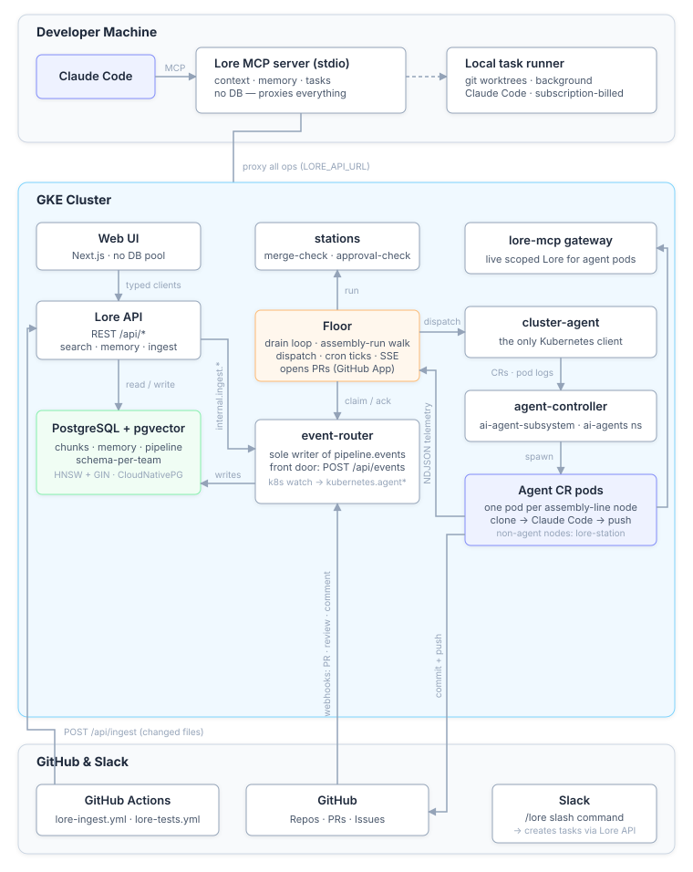
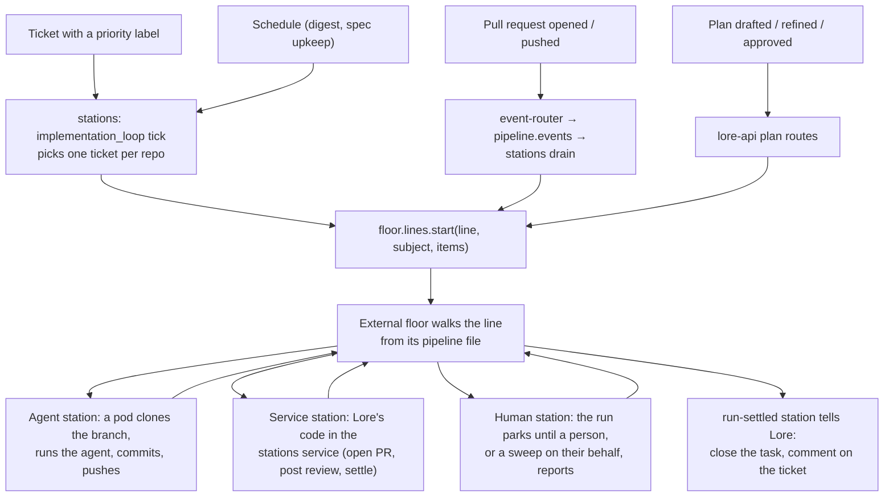
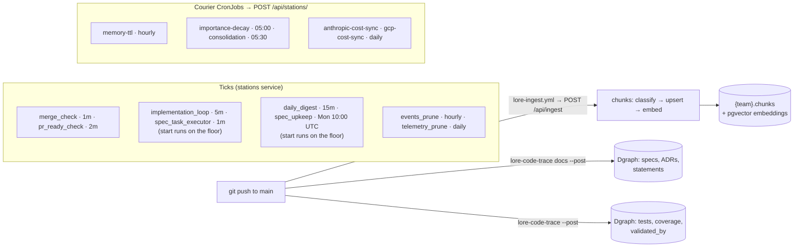

# Architecture

**For people building Lore itself.** This is the deep-dive reference for how the platform fits together: how the pieces connect, how a task flows from creation to a merged PR, how context reaches the vector store, and how the memory system, execution modes, and Dark Factory mode work. If you're using Lore rather than building it, the [user guides](../using-lore/) will serve you better.

Read it top to bottom for the full picture, or jump to the section you're touching.

---

## System topology

How the pieces connect at runtime. The local MCP server proxies every operation to the GKE backend, so all context and memory is org-wide.

Two boundaries are load-bearing and enforced by credentials rather than convention. **`event-router` is the only writer of `pipeline.events`** ([ADR-044](../../adrs/ADR-044-event-router-owns-the-event-bus.md)): every producer reports to its one front door, and each subscriber (today the stations service) claims its deliveries back over HTTP. **`cluster-agent` is the only Lore process that talks to this cluster's Kubernetes API**; nothing dispatches work through it since the engine Lore ran itself was deleted, and its removal is tracked in #2428.

> **Webhook URL.** GitHub delivers to the event-router's `/api/events`; that is the URL lore-api installs on a repo and classifies against (`LORE_WEBHOOK_URL`). A repository onboarded before 2026-09-08 still delivers to the old `/api/webhook/github` path, which the ingress rewrites onto the router, so GitHub never sees a 404. The diagram above predates the external floor: where it shows a Floor, read the external floor.

## Task lifecycle

How work goes from asked-for to merged. Lore decides *when* a run starts and what it is told; the external floor ([re-cinq/floor](https://github.com/re-cinq/floor), [ADR-049](../../adrs/ADR-049-external-floor.md)) walks the run; Lore's stations do the steps that need Lore's data or its GitHub App.

```mermaid
flowchart TB
    T1["Ticket with a priority label"] --> TICK["stations: implementation_loop tick<br/>picks one ticket per repo"]
    T2["Pull request opened / pushed"] --> EV["event-router → pipeline.events →<br/>stations drain"]
    T3["Plan drafted / refined / approved"] --> API["lore-api plan routes"]
    T4["Schedule (digest, spec upkeep)"] --> TICK
    TICK --> START["floor.lines.start(line, subject, items)"]
    EV --> START
    API --> START
    START --> FLOOR["External floor walks the line<br/>from its pipeline file"]
    FLOOR --> AG["Agent station: a pod clones the branch,<br/>runs the agent, commits, pushes"]
    FLOOR --> SVC["Service station: Lore's code in the<br/>stations service (open PR, post review, settle)"]
    FLOOR --> HUM["Human station: the run parks until a person,<br/>or a sweep on their behalf, reports"]
    AG --> FLOOR
    SVC --> FLOOR
    HUM --> FLOOR
    FLOOR --> DONE["run-settled station tells Lore:<br/>close the task, comment on the ticket"]
```

- **A line is a file.** `libs/assembly-lines/src/floor-pipelines/<name>.yaml` holds the graph, what each station needs and produces, and each agent's model and prompt. lore-api puts the files to the floor at boot; a file's content is its version.
- **Nothing is created from a description.** `POST /api/task` creates no task, and there is no route that starts a run by name. Code reaches an agent through a backlog ticket, a feature through a plan, a review through its pull request.
- **CI is the judge.** A line that changes code waits on the pull request's checks at a human station; the `pr-ready-check` sweep reads the verdict and reports it, and a red build goes to a `fix-ci` agent with what failed.
- **People merge.** Nothing merges a pull request by itself. Once someone has merged one, the `merge` line does the bookkeeping: settle the task, close the issue, feed the memory.

## Scheduling and ingestion

The stations service is the scheduler. It emits a `cron.<name>.tick` event per schedule (`libs/shared/src/work/scheduler/cron-emitters.ts`), drains its own deliveries, and runs the sweep that declared that tick. A sweep either does a small data job or starts runs on the external floor. Daily data jobs with nothing to coordinate are Kubernetes CronJobs that post one station and exit ([ADR-019](../../adrs/ADR-019-scheduled-job-runtime-split.md)).

```mermaid
flowchart LR
    subgraph ticks["Ticks (stations service)"]
        direction TB
        J1["merge_check · 1m · pr_ready_check · 2m"]
        J2["implementation_loop · 5m · spec_task_executor · 1m<br/>(start runs on the floor)"]
        J3["daily_digest · 15m · spec_upkeep · Mon 10:00 UTC<br/>(start runs on the floor)"]
        J4["events_prune · hourly · telemetry_prune · daily"]
    end

    subgraph k8scron["Courier CronJobs → POST /api/stations/<name>"]
        direction TB
        C1["memory-ttl · hourly"]
        C2["importance-decay · 05:00 · consolidation · 05:30"]
        C3["anthropic-cost-sync · gcp-cost-sync · daily"]
    end

    PUSH["git push to main"] -->|"lore-ingest.yml → POST /api/ingest"| ING["chunks: classify → upsert → embed"]
    ING --> DB[("{team}.chunks<br/>+ pgvector embeddings")]
    PUSH -->|"lore-code-trace docs --post"| GRAPH[("Dgraph: specs, ADRs,<br/>statements")]
    PUSH -->|"lore-code-trace --post"| TESTS[("Dgraph: tests, coverage,<br/>validated_by")]
```

Context reaches the stores from CI on every push to `main`, never from a schedule: the ingest workflow posts changed files to `/api/ingest`, and the `lore-code-trace` binary posts specs, ADRs and the test report to the traceability graph. The job registry is in [Scheduled Jobs](scheduled-jobs.md).

## Key components

| Component | What it does |
|-----------|-------------|
| [**Lore API**](../../apps/lore-api/README.md) | The remote REST backend (`/api/*`) on GKE (ADR-032). Hybrid search (vector + BM25), agent memory, task CRUD, the push-triggered ingest API, per-client scoped tokens, rate-limited. |
| [**MCP Server**](../../apps/mcp-server/README.md) | A thin local stdio adapter that speaks the MCP protocol to Claude Code and proxies every operation to the Lore API via `LORE_API_URL`. Also hosts the local task runner. The same binary runs in-cluster as the **lore-mcp gateway** (`LORE_MCP_HTTP=1`), giving agent pods live scoped Lore access for a whole run rather than a one-shot hydration, and serving the agent-skills registry. |
| **External floor** | The assembly-line engine ([re-cinq/floor](https://github.com/re-cinq/floor), [ADR-049](../../adrs/ADR-049-external-floor.md)): it walks every line from its pipeline file (`libs/assembly-lines/src/floor-pipelines/*.yaml`) and runs agent stations as `Agent` custom resources. Lore reaches it only through `@re-cinq/floor-client`; lore-api puts the pipeline files to it at boot and mints its git credentials. Lore's own Floor (`apps/floor`) was deleted on 2026-10-02. |
| [**event-router**](../../apps/event-router/README.md) | The single owner of `pipeline.events` (ADR-044). One front door, `POST /api/events`, takes every producer: GitHub webhooks authenticated by HMAC over the raw body, and cron ticks and internal triggers by bearer token. It also serves the delivery endpoints (`/api/deliveries/*`: subscribe, claim, ack, fail, dead-letter, reap, prune, reconcile) every subscriber drains its own `pipeline.event_deliveries` rows through — no endpoint on that side can write an event, because producing and draining are different privileges. |
| [**stations (service)**](../../apps/stations/README.md) | Service stations reached by name over `POST /api/stations/{name}` — the sweeps (`merge-check`, `pr-ready-check`, the ticks that start runs, the housekeeping prunes) and Lore's stations for the external floor. It is also the scheduler: it emits the `cron.*.tick` events and answers them, and it drains the PR-lifecycle events that start and cancel runs. |
| [**Web UI**](../../apps/web-ui/README.md) | Next.js dashboard with GitHub OAuth. Repo-centric view. One-click onboarding. Pipeline monitoring. Analytics dashboard. Global settings. Holds **no** database pool — every read goes through lore-api via typed clients generated from its OpenAPI schema. |
| **PostgreSQL** | CloudNativePG with pgvector. Schema-per-team isolation. HNSW indexes for vector search, GIN for keyword. |
| **GitHub App** | Reads repo content for onboarding. Creates branches, commits, and PRs. Sets Actions secrets for ingest automation. |

## Search

Hybrid search combines vector similarity (Vertex AI `text-embedding-005`, 768 dimensions) with BM25 keyword matching via Reciprocal Rank Fusion (k=60). It degrades gracefully to keyword-only when embeddings are unavailable.

## Agent memory

Lore exposes 40+ MCP tools, memory among them, for persistent state across sessions and restarts. Every memory is versioned, timestamped, and semantically searchable. The MCP adapter holds no database pool ([ADR-032](../../adrs/ADR-032-split-local-remote-api.md)), so every memory operation is proxied to lore-api and learnings are shared org-wide; `~/.lore/memory/` is the fallback when no API is configured.

Key capabilities:

- **Temporal fact invalidation** — facts have validity windows; contradictory facts are automatically invalidated via embedding similarity (threshold 0.92).
- **Confidence tiers** — facts carry `verified`/`observed`/`inferred`/`stale` confidence. Episode-sourced facts default to `observed`, memory-sourced to `inferred`. Unretrieved facts transition to `stale` after 30 days. Context assembly and search include confidence annotations.
- **Retrieval strengthening** — every search asynchronously increments the retrieval count, extends half-life (+2, cap 365), and revives stale→observed. Frequently-used facts survive decay longer.
- **Conflict surfacing** — contradictions are recorded in the `fact_conflicts` table. Context assembly prefixes `[CONFLICT]` on disputed facts (7-day window).
- **Transfer scoring** — cross-repo context is filtered by portable/local keyword heuristics. Only facts with a transfer score ≥ 0.5 pass through, preventing repo-specific config from polluting other repos.
- **Outcome feedback** — merged PRs boost contributing facts' half-life (+5); rejected PRs penalize (-3). Contributing refs are tracked via the `context_refs` JSONB column on tasks.
- **Passive episode ingestion** — `lore_write_episode` accepts raw text (conversations, reviews, observations); facts and knowledge graph entities are extracted automatically. PR review feedback is auto-captured by the review-reactor job. Session summaries are captured via a Stop hook.
- **Live knowledge graph** — entities (services, teams, technologies) and relationships are tracked in PostgreSQL, updated incrementally on every episode. Query with `lore_query_graph`.
- **Graph-augmented search** — `lore_search_memory(graph_augment=true)` enriches results with 1-hop knowledge graph neighbors of detected entities.
- **Context assembly** — `lore_assemble_context` retrieves from all sources and formats into a token-budgeted block using configurable YAML templates (default, review, implementation, research). Supports **subdirectory convention rules** — `.claude/rules/*.md` files loaded conditionally based on task keywords.
- **Self-assembled context** — nothing is fetched before a run (the pre-run hydration was removed 2026-08-28). Every recipe's `{context}` slot carries an instruction to call `lore_assemble_context`, which the pod does over its live MCP gateway.
- **Passive session capture** — the MCP server tracks all tool calls; on session exit it dumps and POSTs a summary as an episode with automatic fact extraction. No explicit `lore_write_episode` needed.
- **Post-task auto-curation** — every task completion (PR, no-changes, failure) automatically captures an episode. High-signal events get Haiku-driven lesson extraction stored as searchable memories.
- **Importance-based decay** — half-life decay model: `strength = 0.5^(age / half_life_days)`. Retrieval count and confidence factor into scoring. Low-value entries are auto-evicted above 500 memories; old invalidated facts are cleaned up beyond a 2000 cap.
- **Automatic consolidation** — groups recent facts by repo and synthesizes higher-level patterns via Haiku, turning noisy raw facts into actionable insights.
- **Privacy filtering** — secrets, API keys, JWTs, and connection strings are stripped before anything is stored in org-wide memory.
- **Retrieval benchmarks** — p50/p95/p99 latency is tracked per tool in the audit log and shown in the analytics dashboard.

## Agent execution modes

| Mode | When | How |
|------|------|-----|
| **Agent station on the external floor** | Every line that needs an agent: code review, the implementation loop, planning and spec writing, onboarding, spec upkeep, the digest | The floor starts one pod per visit from the agent definition in the line's pipeline file (model, image, timeout, prompt). The pod clones the branch it is handed, works, commits and pushes, and reports one of the outcomes its station declares. It reaches Lore's context and memory through the `lore-mcp` gateway for the whole run. |
| **Direct API call** | Small judgements inside a station: curating an episode, extracting facts, consolidating memories | A call through the `Llm` abstraction (`libs/shared/src/outbound/llm/`), recorded in `pipeline.llm_calls`. |
| **Local runner** | A developer says "run locally" | Background `claude --print` in an isolated git worktree on the developer's machine, on their own subscription. Tracked on that machine only. |

An agent that edits code does not run the repository's lint or build in its pod: the pull request's CI is the judge, and the pod reads CI's verdict through `lore_get_ci_failures` instead of reproducing the build.

All direct API calls go through **multi-block prompt caching** ([ADR-015](../../adrs/ADR-015-webhook-driven-review-reactor.md), `libs/shared/src/outbound/llm/prompt-cache.ts`): the system prompt and the tool schemas each carry a cache breakpoint, so an edit to one does not bust the other, and jobs whose prompts are stable within an hour use the one-hour TTL.

## Dark Factory mode

There is no Dark Factory mode to switch on. It was a per-repo settings block (`dark_factory`: enabled, issue creation, auto-merge paths, review mode, notify channels) read by the assembly-line engine Lore ran itself. That engine was deleted on 2026-10-02 (ADR-049, epic #2342) and the settings went with it: the settings route, the Dark Factory tab and the stored block. Every assembly line now runs on the external floor, pull requests are merged by people, and no repository ever had the block set.

Two things outlived it. Every Lore-authored commit still carries the `Lore-Task:` trailer. The two-key approval ceremony (admin scope plus an open pull request labeled `dark-factory-approval` by a CODEOWNER) still guards a custom agent image (`specs/two-key-approval`). The design record is ADR-016 and `specs/6-dark-factory/`.

---

## See also

- [Scheduled Jobs](scheduled-jobs.md) — the complete cron/job registry referenced by the scheduling diagram.
- [Contributing](contributing.md) — run the stack locally, project layout, tech stack, design principles.
- [Platform Engineer Guide](../using-lore/platform-engineer.md) — operating these components in production.
- [Back to README](../../README.md)
