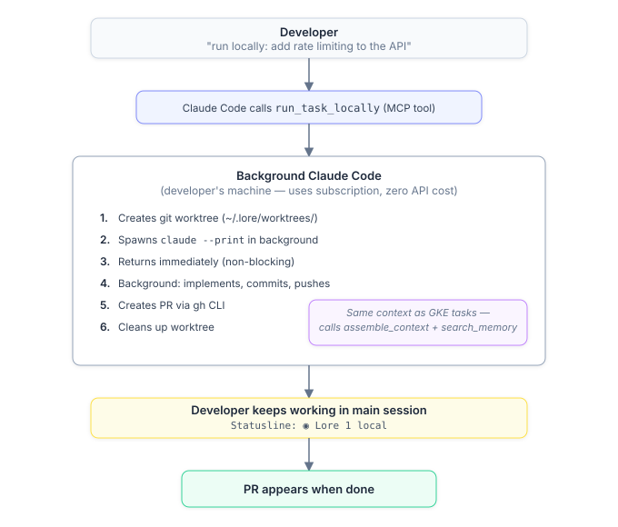
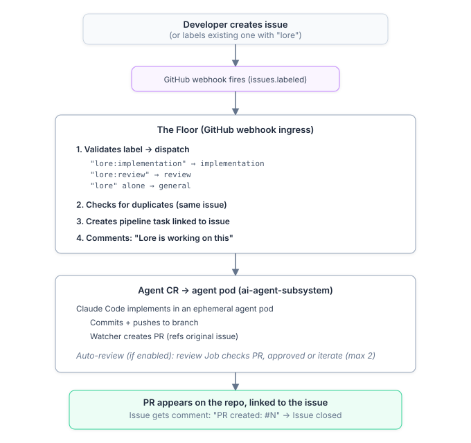

# Developer Guide

**For developers writing code with Claude Code.** This guide shows how Lore gives Claude Code instant awareness of your org — conventions, ADRs, prior decisions, and team patterns — and how to hand work off to background agents without leaving your editor, your terminal, or Slack.

Once you've run `scripts/install.sh`, there's nothing to configure per repo. Open Claude Code in any onboarded repo and the context is already there.

**Lost? Type `/lore-help`.** It answers in the terminal what this guide answers on the web: what Lore is, how a session works, every Lore skill (documented by the skills themselves), and an "I want to…" router that points at the right skill *or* tool. `/lore-help <skill>` gives one skill's full entry; `/lore-help "how do I hand this to an agent?"` routes a plain-English question.

---

## Get org context in Claude Code

After `install.sh`, Claude Code automatically loads org context for whatever repo you're in. The [MCP server](../../apps/mcp-server/README.md) runs locally over stdio and proxies every operation to the GKE backend, so the knowledge you and your teammates accumulate is shared org-wide. There is no offline mode — the backend must be reachable, and the install script sets `LORE_API_URL` for you.

Every session follows an enforced workflow so agents never re-solve a problem the org already solved:

1. **`lore_assemble_context`** runs first — loads conventions, ADRs, memories, facts, and the knowledge graph in one call.
2. **`lore_search_memory`** runs before planning or building — checks whether the problem was already solved, using several queries.
3. **During work** — `lore_search_context`, `lore_query_graph`, and `lore_create_pipeline_task` as needed.
4. **Session end** — `lore_write_memory` with a session summary, and `lore_write_episode` for passive fact extraction.

In practice you just talk to Claude and the context appears:

```bash
# Context + memory loaded automatically — Claude just knows
claude "how do we handle auth in this repo?"
# → lore_assemble_context pulls CLAUDE.md, ADRs, team patterns, relevant memories

claude "what was the decision on database migrations?"
# → Returns relevant ADRs with rationale and alternatives rejected

# Persistent memory across sessions — shared org-wide
claude "remember that we decided to use UUIDs for all new tables"
# → Stored via lore_write_memory, searchable next session by the whole org

# Knowledge graph — entity relationships
claude "what uses PostgreSQL in our infrastructure?"
# → lore_query_graph returns: auth-service, lore-agent, etc.

# Delegate work to the agent pipeline (proxied to GKE)
claude "create a runbook for database failover in re-cinq/my-service"
# → lore_create_pipeline_task → agent picks it up → PR created

# Check task status
claude "what's the status of my last pipeline task?"
# → Returns status, PR link, duration
```

## Run a task locally (zero API cost)

Say "run locally" and Claude Code spawns a background process in an isolated git worktree on your machine. It uses your Claude Code subscription — no API credits — and your interactive session continues uninterrupted. The background process has its own MCP server instance and calls `lore_assemble_context` and `lore_search_memory` before it writes any code, so it starts with the same context a GKE task would.

<p align="center"></p>

## Dispatch from a GitHub Issue

Add a `lore` label to any Issue on an onboarded repo — or open one with the Lore issue template — and Lore creates a pipeline task from it, implements the change, and opens a PR linked back to the Issue. No UI, no CLI, no context switch.

<p align="center"></p>

The label determines the task type:

- `lore` → general task
- `lore:implementation` → implementation task (runs on the ai-agent-subsystem)
- `lore:review` → review task
- `lore:runbook` → runbook task

Separate from the routing labels above, the implementation loop (`specs/implementation-loop/spec.md`) reads a priority taxonomy. These labels are a queue ordering, not a dispatch: applying one opts the issue into the repo's backlog loop when `implementation_loop.enabled` is on, and no second `lore` label is needed.

- `priority:high` → worked first
- `priority:medium` → worked after every `priority:high`
- `priority:low` → worked when nothing else is queued
- `lore:blocked` → set by the loop when a ticket gets stuck; makes the issue ineligible until a human removes it

An issue carrying more than one `priority:*` label is skipped rather than resolved to the highest, so the ambiguity surfaces to a human.

If an active task already exists for the Issue, Lore comments with the existing task ID instead of starting a duplicate. Issue templates ("Lore: Implementation", "Lore: Review", "Lore: General Task") are added during onboarding.

This requires a webhook on the GitHub App — `POST https://LORE_API_DOMAIN/api/webhook/github` with the HMAC secret from `LORE_WEBHOOK_SECRET` — subscribed to:

- **Issues** — label dispatch (above)
- **Pull request** — spec-PR merge detection and review-reactor wake-up on sync/open/reopen
- **Pull request review** — wakes the review reactor on `CHANGES_REQUESTED`
- **Issue comment** — catches reviewer comments typed from mobile (GitHub routes these as Issue comments on the PR)

## Dispatch from Slack

Type `/lore` in any Slack channel mapped to a repo:

```
/lore implementation add rate limiting to the API
/lore general analyze our test coverage gaps
/lore runbook database failover procedure
/lore retry <task_id>
```

Lore creates the task, runs the agent, and posts back to the same channel when a PR is created, when a task completes with a GitHub Issue, or when a task fails (with an error summary). You never leave Slack.

## Track what Lore is doing

Every pipeline task opens a GitHub Issue on the target repo labeled `lore-managed`, so Lore's work shows up in your normal GitHub notifications:

- A task starts on your repo → Issue opened
- The agent creates a PR → comment with the PR link, Issue closed
- A task fails → Issue stays open with the `lore-failed` label

Filter any repo with `label:lore-managed` to see all Lore activity at a glance.

> Under **Dark Factory mode** this narrows: Lore stops opening a status Issue per task, and the PR (carrying a `Lore-Task: <uuid>` trailer) becomes the canonical artifact. See the [Platform Engineer Guide](platform-engineer.md#dark-factory-mode) and the [Architecture](../building-lore/architecture.md#dark-factory-mode) reference.

## MCP tools available to Claude Code

| Tool | Category | What it does |
|------|----------|-------------|
| `lore_assemble_context` | Context | Retrieve + assemble context from all sources (CLAUDE.md, ADRs, memories, facts, graph) into a token-budgeted block. Supports `cross_repo` for multi-repo context |
| `lore_search_context` | Context | Hybrid search (vector + keyword) across all org context |
| `lore_write_memory` | Memory | Store a persistent memory with optional TTL and fact extraction |
| `lore_read_memory` | Memory | Retrieve by key, supports version history |
| `lore_search_memory` | Memory | Semantic search across memories and facts. Supports `include_invalidated` for history, `graph_augment` for 1-hop graph enrichment |
| `lore_list_memories` | Memory | Paginated listing of active memories |
| `lore_delete_memory` | Memory | Soft-delete (preserved in history) |
| `lore_write_episode` | Memory | Ingest raw text; auto-extracts facts and updates the knowledge graph |
| `lore_query_graph` | Memory | Query the live knowledge graph for entities and relationships |
| `lore_agent_stats` | Memory | Health, memory count, episode count, facts, searches, daily breakdown |
| `lore_create_pipeline_task` | Pipeline | Create a task on GKE. Supports `group_id` for multi-repo coordination |
| `lore_run_task_locally` | Pipeline | Run a task in the background on your machine (uses your subscription) |
| `lore_list_local_tasks` | Pipeline | Show running/completed local background tasks |
| `lore_cancel_local_task` | Pipeline | Cancel a local background task |
| `lore_enable_task_notifications` | Pipeline | Start watching for pending tasks (statusline indicator) |
| `lore_list_pending_tasks` | Pipeline | Show tasks available to claim locally |
| `lore_claim_and_run_locally` | Pipeline | Claim a pending task and run it in the background |
| `lore_get_pipeline_status` | Pipeline | Task status and event timeline |
| `lore_list_pipeline_tasks` | Pipeline | List tasks with a status filter |
| `lore_cancel_task` | Pipeline | Cancel a running or pending task |
| `lore_retry_task` | Pipeline | Retry a failed task (creates a new task linked to the original) |
| `lore_get_pr_status` | Pipeline | Live GitHub PR state (checks, reviews, merge status) |
| `lore_sync_tasks` | Tasks | Parse `tasks.md` and sync to the pipeline database |
| `lore_ready_tasks` | Tasks | List unblocked tasks (all dependencies satisfied) |
| `lore_claim_task` | Tasks | Atomically claim a task to prevent double work |
| `lore_complete_task` | Tasks | Mark done, report newly unblocked dependents |
| `lore_get_analytics` | Repos | Task throughput and token usage by period |
| `lore_list_repos` | Repos | All onboarded repos with activity stats |
| `lore_onboard_repo` | Repos | Onboard a new repo to Lore |
| `lore_get_task_logs` | Pipeline | Fetch a task's execution transcript (no UI needed) |
| `lore_list_task_group` | Pipeline | List all tasks in a multi-repo task group |
| `lore_my_usage` | Pipeline | Per-developer task and token usage (today, 7-day, 30-day) |
| `lore_ingest_files` | Ingest | Manually ingest files into Lore's context store |

---

## See also

- [Product Manager Guide](product-manager.md) — the full idea-to-merge feature lifecycle, including the `/lore-feature` and `/lore-pr` implementation steps you'll run as the engineer.
- [Platform Engineer Guide](platform-engineer.md) — onboarding a repo so its context shows up here, plus per-repo settings.
- [Architecture](../building-lore/architecture.md) — how context is collected, stored, and pulled under the hood.
- [Back to README](../../README.md)
