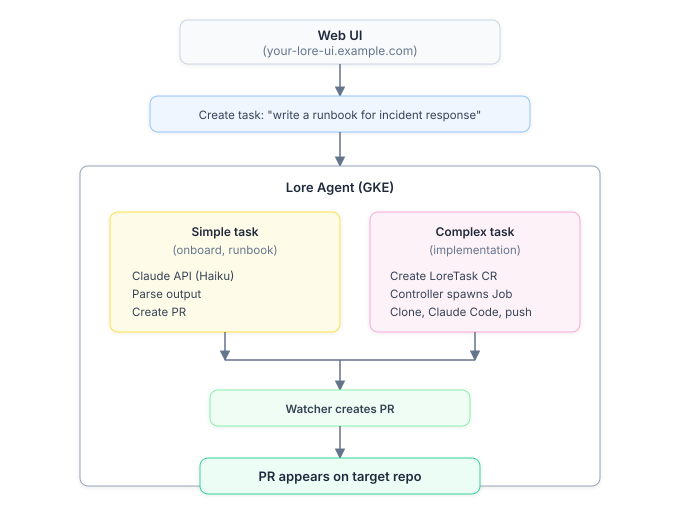

# Platform Engineer Guide

**For the people who operate Lore for their org.** This guide covers the day-to-day of running the platform: onboarding repos, tuning per-repo and global settings, watching the pipeline, reading analytics, and the API security model. For first-time deployment of the backend itself, see [Installation & Deployment](../INSTALL.md).

If you're standing up Lore for the first time, deploy the backend first, then come back here to onboard your repos.

---

## Tasks via the Web UI or API

A product owner or platform engineer creates a task through the dashboard. The [Floor](../../apps/floor/README.md) processes it — either via a direct API call (simple tasks) or by dispatching `Agent` CRs on the [ai-agent-subsystem](../../infra/terraform/modules/gke-mcp/lore-platform/charts/ai-agents-helm/README.md) in the `ai-agents` namespace (complex tasks; one pod per assembly-line node, advanced by the event-driven Floor walk). The Floor holds no Kubernetes client of its own: dispatch, pod logs, and per-task tokens all go through the [**cluster-agent**](../../apps/cluster-agent/README.md) service.

<p align="center"></p>

## Onboard a repo

Onboarding inspects the target repo, checks what files already exist, and generates only what's missing — so it's safe to run against repos that already have some of these files.

**Via the UI:**

1. Go to `LORE_UI_DOMAIN/onboard`
2. Enter `owner/repo` (e.g. `re-cinq/my-service`)
3. Click **Onboard Repository**
4. The agent inspects the repo and generates the files below
5. A PR appears on the target repo — review and merge it
6. Ingest secrets are configured automatically

**Via the CLI:**

```bash
claude "onboard re-cinq/my-service to lore"
```

For repos not yet onboarded, developers can still ingest specific files manually:

```bash
claude "ingest CLAUDE.md and the ADRs into Lore"
```

**What gets generated** (only files that don't already exist):

| File | Purpose |
|------|---------|
| `AGENTS.md` | Context loading order, workflow commands, conventions for AI agents |
| `adrs/ADR-*.md` | Architectural decisions inferred from the codebase |
| `.specify/spec.md` | A system specification describing what the repo does today |
| `.github/PULL_REQUEST_TEMPLATE.md` | Structured PR template (Why, Alternatives, ADRs) |
| `.github/workflows/pr-description-check.yml` | CI enforcing PR description quality |
| `.github/workflows/lore-ingest.yml` | Push-triggered context ingestion |

After the PR merges, the agent automatically configures ingest secrets so context stays fresh on every push.

## Monitor the pipeline

**Web UI** (`LORE_UI_DOMAIN`):

- The **Pipeline** page shows all tasks with status, PR links, and live PR state badges
- The **task detail** page streams live agent output in a terminal-style log viewer (polls every 10s while running)
- The **repo** view shows context, active tasks, and memory for each repo
- The **search** page queries across all onboarded repos

**Agent health** endpoint:

```bash
curl https://LORE_API_DOMAIN/healthz
# Unauthenticated: returns {"status":"ok"}
# Authenticated: adds database status and task counts
```

LLM usage is tracked per task in the `pipeline.llm_calls` table (model, tokens, duration).

## Analytics

The analytics dashboard at `LORE_UI_DOMAIN/analytics` shows:

- Task summary by status (total, succeeded, failed, active)
- Retrieval performance (p50/p95/p99 latency per MCP tool, 200ms threshold)
- Token usage by task type and by repo
- Daily usage trend (LLM calls, input/output tokens)
- Scheduled job run history

Additional pages:

- `/episodes` — browse ingested episodes with a source filter and fact counts
- `/graph` — explore knowledge graph entities, relationships, and temporal validity

The same data is available programmatically via the `lore_get_analytics` MCP tool.

## Per-repo settings

Each onboarded repo has configurable settings at `LORE_UI_DOMAIN/repos/{owner}/{repo}/settings`:

| Setting | What it does |
|---------|-------------|
| **Team** | Groups repos for schema-level context isolation |
| **Task Types** | Allowed task types (comma-separated) |
| **Slack Channel** | Maps a Slack channel for `/lore` command dispatch |
| **Dispatch Label** | GitHub label that triggers task creation (default: `lore`) |
| **Trust Level** | Controls which task types agents can run: docs → tests → implementation → full. Auto-promotes after 3 successful merges |
| **Auto-review** | Automatically review agent PRs against conventions |
| **Cross-repo context** | Multi-select: which other repos to include in context assembly. Links are bidirectional |
| **Task overrides** | Per-task-type: model, timeout, system_prompt_suffix, review_required (via API/DB) |

## Global settings

Platform configuration lives at `LORE_UI_DOMAIN/settings`:

- **API URL** — the external Lore API endpoint (`LORE_API_URL`); the local MCP adapter proxies every operation to it
- **Ingest Token** — shared auth token for API calls (legacy single-token mode)
- **Regenerate Token** — rotates the token (invalidates all existing)
- **Dev Install Command** — copy-paste for new developer onboarding
- **Approval Gates** — require human approval before agents process tasks (per-repo or global)

## API security

All `/api/*` endpoints require bearer token auth, enforced centrally in the router. Two token types:

| Type | Format | Scope | Use case |
|------|--------|-------|----------|
| **Legacy token** | `LORE_INGEST_TOKEN` env var | Full access | Backward compat, `install.sh` setup |
| **Per-client token** | `lore_<64 hex chars>` | Scoped (read/write/task/webhook/admin) | CI, integrations, per-developer |

Manage per-client tokens via `/api/tokens` (admin-only). Rate limits: 30/min webhooks, 60/min task ops, 200/min other.

## Set up Slack

1. Create a Slack app from `scripts/slack-app-manifest.yaml`
2. Store the signing secret and bot token in `secrets.tfvars` (`slack_signing_secret`, `slack_bot_token`)
3. `terraform apply` to sync secrets via ESO
4. Map channels to repos: `UPDATE lore.repos SET settings = settings || '{"slack_channel_id":"C..."}'`
5. Invite the bot to each channel

Developers then use `/lore` in those channels — see the [Developer Guide](developer.md#dispatch-from-slack).

## Register a new execution cluster (satellite)

By default every station run executes on the central GKE cluster. A **satellite** lets station runs execute on a cluster you own — a developer's minikube, a customer cluster, a GPU box — by registering one cluster-agent per cluster ([spec](../../specs/running-stations-in-any-k8s-cluster/spec.md)). The satellite pulls work (the GitLab Runner model): it claims queued station runs from the central lore-api, launches them as Agent CRs locally, and reports outcomes back — so it works from behind NAT with no inbound access.

**One-time central setup.** Set `cluster_agent_registration_token` in `secrets.tfvars` and `terraform apply`. The token lands in GCP Secret Manager as `lore-cluster-agent-registration-token`, ESO mirrors it into the `lore-api` namespace, and lore-api starts accepting registrations. Leave it empty and `POST /api/cluster-agents/register` answers 401 — satellites stay disabled.

**Install a satellite.** Point `kubectl` at the target cluster and run the install script — it checks the toolchain, creates the namespaces, vendors the chart dependency, and `helm upgrade --install`s the release (idempotent; re-running is free):

```bash
scripts/install-satellite.sh \
  --api-url https://lore-api.example.com \
  --event-router-url https://lore-events.example.com \
  --registration-token <token from your platform engineer> \
  --name gpu-box-1 \
  --tags node:agent,node:validate
```

It also needs `GHCR_USERNAME`/`GHCR_TOKEN` (image pulls) and an LLM credential in the env — `CLAUDE_CODE_OAUTH_TOKEN` (from `claude setup-token`; bills a subscription) or `ANTHROPIC_API_KEY` (bills the org). Every flag can come from env instead (`LORE_API_URL`, `EVENT_ROUTER_URL`, `LORE_CLUSTER_AGENT_REGISTRATION_TOKEN`, `LORE_CLUSTER_AGENT_NAME`, `LORE_CLUSTER_AGENT_TAGS`). Pass `--context <name>` to assert which kubectl context the install must land in, and `--no-network-policy` on single-node clusters without a CNI. For a laptop minikube there is a wrapper with the right defaults baked in: `scripts/install-satellite-minikube.sh`.

Under the hood both drive the standalone chart at `infra/terraform/modules/gke-mcp/lore-platform/charts/cluster-agent-standalone-helm` (deliberately *not* part of the `lore-platform` umbrella); install it with plain `helm` if you need values the script does not surface.

**What happens on first boot.** The satellite registers under `name`, receives a durable id and a per-agent bearer token (the plaintext exists once, in that response; only its SHA-256 is stored centrally), and persists the identity in the `lore-cluster-agent-identity` Kubernetes Secret — written through the Kubernetes API, since the pod's filesystem is read-only. Restarts re-register with the persisted token instead of minting a new identity. It then polls for claims and heartbeats every 30 s.

**Routing work to it.** A station run is claimable by a satellite when the satellite's `tags` contain every one of the run's `required_tags` (set per node in the assembly-line YAML, or per repo via `station_default_tags` in the repo settings). A run with no required tags is claimable by every registered cluster, including the central one. A run whose tags no cluster carries fails after the 30-minute queue wait, naming the unmatched tags.

**Watching it.** The **Clusters** page in the web UI (`/cluster-agents`) lists every registered agent with its tags, liveness, and running-claims count (the count links to that agent's runs). An agent silent for 5 minutes is marked `offline`; its claims are requeued for another cluster and the event shows in the page's offline-events table.

**Identity rules worth knowing.** Names are first-come: re-registering an existing name requires the current per-agent token (`409` otherwise), so the shared registration token alone can never take over a live cluster's identity. If a satellite's identity Secret is lost, delete its registry row (or pick a new name) before re-registering. Rotating the registration token invalidates nothing already registered — per-agent tokens are independent.

## Dark Factory mode

Dark Factory mode lets a repo run autonomously by default, with humans only at intent definition and stage-gate validation. Enabling it for a repo is a single per-repo switch — `lore.repos.settings.dark_factory.enabled = true` via the settings UI / API. Toggling it is a privileged change guarded by two-key authorization: admin scope **plus** an open PR labeled `dark-factory-approval` by a CODEOWNER of the repo's `CLAUDE.md`.

All tasks execute on the ai-agent-subsystem (`Agent` CRs in the `ai-agents` namespace) regardless of mode; the legacy LoreTask path and its `LORE_DARK_FACTORY_CLUSTER_ENABLED` cluster gate were removed in the ADR-031 cutover. The setting defaults to **off**, so there's no behavior change for existing repos.

Rollout, rollback, the pilot procedure, and audit-log queries live in `runbooks/dark-factory-rollback.md`. For the full design — branch-as-state, auto-merge gates, two-key authorization — see the [Architecture reference](../building-lore/architecture.md#dark-factory-mode), ADR-016, and `specs/6-dark-factory/`.

---

## See also

- [Installation & Deployment](../INSTALL.md) — deploy the Lore backend on GKE (do this first).
- [Developer Guide](developer.md) — what your developers experience once a repo is onboarded.
- [Architecture](../building-lore/architecture.md) and [Scheduled Jobs](../building-lore/scheduled-jobs.md) — how the platform works internally.
- [Back to README](../../README.md)
