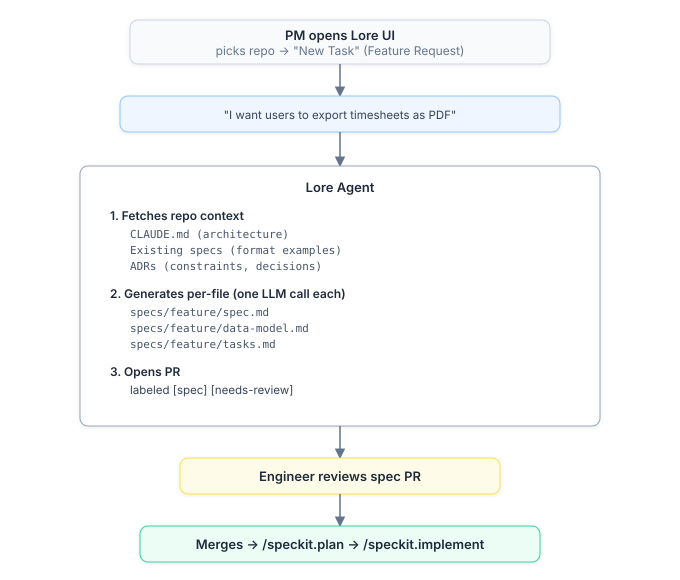

# Product Manager Guide

**For product managers turning ideas into shipped code.** You describe what you want in plain language; Lore translates it into a proper engineering spec that follows the repo's conventions, and an engineer takes it from there. You never need to know speckit, MADR, or any technical format.

This guide walks the whole journey — from your one-paragraph idea to a merged pull request — so you can see exactly where your part begins and ends.

---

## From intent to a spec

A PM describes a feature in everyday language. Lore fetches the repo's context and generates the engineering artifacts — spec, data model, and task breakdown — matching the patterns already in that codebase.

<p align="center"></p>

## The feature lifecycle, end to end

Here is how a feature goes from a product manager's idea to production code, step by step.

```
PM idea → agent spec PR → engineer review → engineer implements → PR → merge
```

### Step 1 — You describe the feature (Lore UI)

Open `LORE_UI_DOMAIN` → pick your repo → **New Task** → **Feature Request**.

Describe what you want in plain language. No technical jargon needed:

> *"I want users to be able to export their approved timesheets as PDF, grouped by project, with the company logo. Should work for a single month or a custom date range."*

Click **Create Task**. That's it for you.

### Step 2 — The agent generates the spec (automatic)

Within about 10 minutes, the Lore Agent:

- Fetches the repo's context (CLAUDE.md, ADRs, existing specs, org memories)
- Generates `specs/export-timesheets-pdf/spec.md` — a proper engineering spec with problem statement, user scenarios, functional requirements, and success criteria
- Generates `specs/export-timesheets-pdf/data-model.md` — the database changes needed
- Generates `specs/export-timesheets-pdf/tasks.md` — an implementation checklist with file paths that match the actual project structure
- Opens a PR on the repo labeled `spec` + `needs-review`
- Creates a GitHub Issue linking everything together

The agent matches the repo's existing conventions automatically.

### Step 3 — An engineer reviews the spec (GitHub)

The engineer sees the GitHub Issue notification, opens the spec PR, and reviews the requirements — are the user scenarios right? any missing edge cases? They refine anything the agent got wrong and merge the PR. The spec files (`spec.md`, `data-model.md`, `tasks.md`) now live on `main`.

### Step 4 — The engineer implements with Claude Code

```bash
cd ~/projects/re-cinq/re-plan
claude
```

Then:

```
/lore-feature
```

Claude will:

1. List available specs in `specs/` — the engineer picks `export-timesheets-pdf`
2. Read the spec, data model, and task breakdown
3. Create a feature branch: `feat/export-timesheets-pdf`
4. Work through tasks in order — implementing each, marking `- [x] T001` in `tasks.md`, and committing (`feat(time): add PDF export service`)
5. Pause to confirm before moving to the next task
6. Repeat until all tasks are done or the engineer stops

### Step 5 — The engineer opens the PR

```
/lore-pr
```

Claude reads the spec, diffs against `main`, finds related ADRs, drafts a complete PR description (Why, What Changed, Alternatives, Testing), shows it for review, and — after confirmation — pushes the branch and opens the PR via `gh pr create`.

### Step 6 — Review and merge

The PR goes through normal code review. If the repo has `auto_review: true`, Lore reviews the PR against the spec and conventions first — no human needed for the first pass. If changes are requested, a fix task is created automatically (up to 2 iterations before escalating to a human).

The entire flow from "I want X" to merged code happens with proper specs, tracked tasks, and structured PRs at every step.

---

## See also

- [Developer Guide](developer.md) — the engineer's side: `/lore-feature`, `/lore-pr`, and the MCP tools used during implementation.
- [Platform Engineer Guide](platform-engineer.md) — monitoring task progress in the UI and analytics.
- [Back to README](../../README.md)
